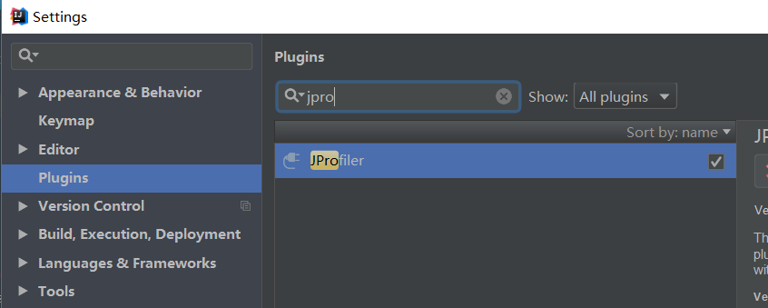
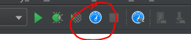
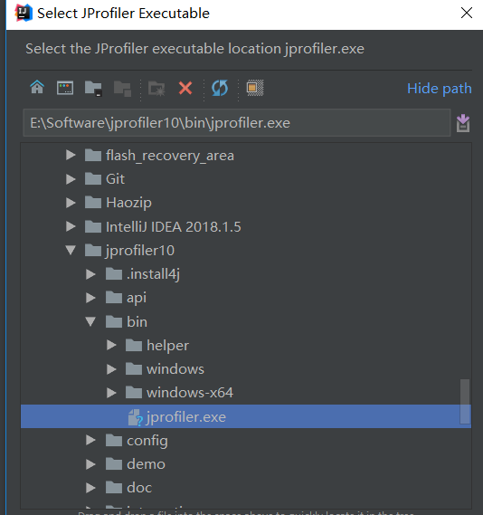

# IntelliJ IDEA集成JProfiler，入门教程

> 参考：https://www.cnblogs.com/zhangyaxiao/p/6678385.html

## 说明：

JProfiler是用于分析J2EE软件性能瓶颈并能准确定位到[Java](http://lib.csdn.net/base/javase)类或者方法有效解决性能问题的主流工具，它通常需要与性能[测试](http://lib.csdn.net/base/softwaretest)工具如：LoadRunner配合使用，因为往往只有当系统处于压力状态下才能反映出性能问题。

## 安装

jProfiler下载地址 <http://www.ej-technologies.com/download/jprofiler/files>

本地安装

next就可以了，注册码就直接网上找一个就可以了

## idea集成插件

安装

重启IDEA，点击

选择目录

