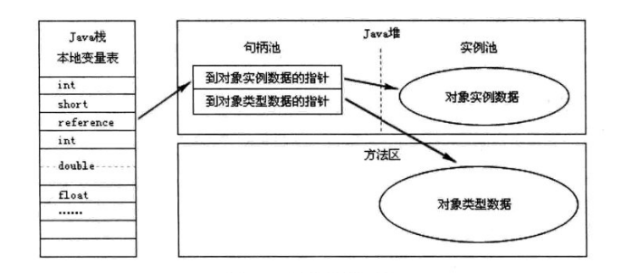
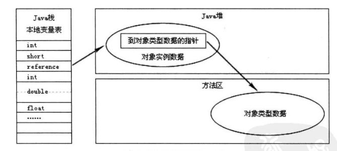

# 深入理解Java虚拟机

## 第一章 走进Java

### 1.概论


我们可以吧**Java程序设计语言**、**Java虚拟机**、**Java API类库**这三部分统称为JDK（Java Development Kit），JDK是用于支持Java程序开发的**最小环境**。

可以把Java API类库中的**Java SE API 子集**和**Java虚拟机**这两部分统称为JRE（Java Runtime Environment）JRE是支持Java程序运行的**标准环境。**

## 第二章 Java 内存区域与内存溢出异常

Java虚拟机所管理的内存将会包括以下几个运行时数据区域：


###  1、程序计数器

​	当线程在执行一个 **Java 方法**时，该计数器记录的是正在执行的虚拟机字节码指令的地址，当线程在执行的是 **Native 方法**（调用本地操作系统方法）时，该计数器的值为**空**。

​	另外，该内存区域是唯一一个在 Java 虚拟机规范中**没有**规定任何 OOM（内存溢出：OutOfMemoryError）情况的区域。

​	每条线程都有一个独立的的程序计数器

### 2、Java虚拟机栈

​	虚拟机栈描述的是 **Java 方法**执行的内存模型：每个方法被执行的时候都会同时创建一个栈帧，栈是用于支持续虚拟机进行**方法调用**和**方法执行**的数据结构。

> 在**单线程**的操作中，虚拟机抛出的都是 **StackOverflowError 异常**
>
> 而在**多线程**环境下，则会抛出 **OutOfMemoryError 异常**。
>
> 

**栈帧中所存放的各部分信息的作用和数据结构**

#### 2.1 局部变量表

​	局部变量表是一组变量值存储空间，用于存放**方法参数**和**方法内部定义的局部变量**，其中存放的数据的类型是编译期可知的各种基本数据类型、对象引用（reference）和 returnAddress 类型（它指向了一条字节码指令的地址）。其中64位长度的long和double类型的数据会占用2个局部变量空间（Slot），其余的数据类型只占用1个。局部变量表所需的内存空间在**编译期间**完成分配，当进入一个方法时，这个方法需要在帧中分配多大的局部变量空间是**完全确定**的，在方法运行期间**不会改变**局部变量表的大小。

#### 2.2 操作数栈

​	操作数栈又常被称为操作栈，操作数栈的最大深度也是在编译的时候就确定了。当一个方法开始执行时，它的操作栈是空的，在方法的执行过程中，会有各种字节码指令（比如：加操作、赋值元算等）向操作栈中写入和提取内容，也就是入栈和出栈操作。

> 基于栈的指令集最主要的优点是可移植性强，主要的缺点是执行速度相对会慢些；(Java虚拟机)
>
> 而由于寄存器由硬件直接提供，所以基于寄存器指令集最主要的优点是执行速度快，主要的缺点是可移植性差；（Android 虚拟机）

#### 2.3 动态链接

​	每个栈帧都包含一个指向运行时常量池（在方法区中，后面介绍）中该栈帧所属方法的引用，持有这个引用是为了支持方法调用过程中的动态连接。Class 文件的常量池中存在有大量的符号引用，字节码中的方法调用指令就以常量池中指向方法的符号引用为参数。这些符号引用，一部分会在类加载阶段或第一次使用的时候转化为直接引用（如 final、static 域等），称为静态解析，另一部分将在每一次的运行期间转化为直接引用，这部分称为动态连接。

#### 2.4 方法返回地址

​	方法退出的过程实际上等同于把当前栈帧出站，因此退出时可能执行的操作有：恢复上层方法的局部变量表和操作数栈，如果有返回值，则把它压入调用者栈帧的操作数栈中，调整 PC 计数器的值以指向方法调用指令后面的一条指令。

### 3、本地方法栈

​	该区域与虚拟机栈所发挥的作用非常相似，只是虚拟机栈为虚拟机执行 Java 方法服务，而本地方法栈则为使用到的本地操作系统（Native）方法服务，会抛出StackOverflowError和OutOfMemoryError异常。（Sun HotSpot虚拟机把本地方法栈和虚拟机栈合二为一）

### 4、Java堆

​	Java Heap 是 Java 虚拟机所管理的内存中最大的一块，它是所有线程共享的一块内存区域。几乎所有的对象实例和数组都在这类分配内存。Java Heap 是垃圾收集器管理的主要区域，因此很多时候也被称为“GC堆”。

​	根据 Java 虚拟机规范的规定，Java 堆可以处在物理上不连续的内存空间中，只要逻辑上是连续的即可。如果在堆中没有内存可分配时，并且堆也无法扩展时，将会抛出 OutOfMemoryError 异常。

​	Java堆可以处于物理上不连续的内存空间中。

### 5、方法区

​	方法区也是各个线程共享的内存区域，它用于存储已经被虚拟机加载的类信息、常量、静态变量、即时编译器编译后的代码等数据。方法区域又被称为“永久代”，但这仅仅对于 Sun HotSpot 来讲，JRockit 和 IBM J9 虚拟机中并不存在永久代的概念。

#### 5.1 运行时常量池

运行时常量池是方法区的一部分，用于存放编译器生成的各种字面量和符号引用，这部分内容将在类加载后进入方法区的运行时产量池中存放。

> Java 语言并不要求常量一定只能在编译期产生，也就是并非预置入 Class 文件中的常量池的内容才能进入方法区的运行时常量池，运行期间也可能将新的常量放入池中，这种特性被开发人员利用比较多的是 String 类的 intern（）方法。


### 6、直接内存

​	直接内存并不是虚拟机运行时数据区的一部分，也不是 Java 虚拟机规范中定义的内存区域，它直接从操作系统中分配，因此不受 Java 堆大小的限制，但是会受到本机总内存的大小及处理器寻址空间的限制，因此它也可能导致 OutOfMemoryError 异常出现。

### 7、内存溢出的测试方法


### 8、内存泄漏和内存溢出的区别

​	内存泄露是指分配出去的内存没有被回收回来，由于失去了对该内存区域的控制，因而造成了资源的浪费。Java 中一般不会产生内存泄露，因为有垃圾回收器自动回收垃圾，但这也不绝对，当我们 new 了对象，并保存了其引用，但是后面一直没用它，而垃圾回收器又不会去回收它，这边会造成内存泄露，

​	内存溢出是指程序所需要的内存超出了系统所能分配的内存（包括动态扩展）的上限。


### 9、HotSpot虚拟机对象探秘

#### 9.1 对象的创建

​	在类加载检查通过后，接下来虚拟机将为新生对象分配内存。

- 假设Java堆中的内存是足够规整的，所有用过的内存放一边，没用过的内存放一边，中间放着一个指针作为分界点的指示器，那所分配内存就仅仅是把那个指针向空闲的空间挪动一段与对象大小相等的距离，这种方式称为“指针碰撞”。
- 如果Java堆内存不是规整的，虚拟机就必须维护一个列表，记录哪些内存块是可以用的，并在分配后更新列表记录。这种方式称为“空闲列表”

> 选择哪种方式由Java堆是否规整决定，而是否规整又由垃圾收集器是否带有压缩整理功能决定。

除如何划分可用空间之外，还有另外一个需要考虑的问题是对象创建在虚拟机中是非常频繁的行为，即使是仅仅修改一个指针所指向的位置，在并发情况下也并不是线程安全的，可能出现正在给对象A分配内存，指针还没来得及修改，对象B又同时使用了原来的指针来分配内存的情况。 解决这个问题有两种方案，一种是对分配内存空间的动作进行同步处理——实际上虚拟机采用CAS配上失败重试的方式保证更新操作的原子性；另一种是把内存分配的动作按照线程划分在不同的空间之中进行，即每个线程在Java堆中预先分配一小块内存，称为本地线程分配缓冲（Thread Local Allocation Buffer,TLAB）。 哪个线程要分配内存，就在哪个线程的TLAB上分配，只有TLAB用完并分配新的TLAB时，才需要同步锁定。虚拟机是否使用TLAB，可以通过-XX：+/-UseTLAB参数来设定。 

接下来，虚拟机要对对象进行必要的设置，例如这个对象是哪个类的实例、 如何才能找到类的元数据信息、 对象的哈希码、 对象的GC分代年龄等信息。 这些信息存放在对象的对象头（Object Header）之中。  

#### 9.2 对象的内存布局

在HotSpot虚拟机中，对象在内存中存储的布局可以分为3块区域：对象头（Header）、实例数据（Instance Data）和对齐填充（Padding）。

##### 9.2.1 对象头

HotSpot虚拟机的对象头包括**两部分**信息：

第一部分用于存储对象自身的运行时数据，如哈希码（HashCode）、 GC分代年龄、 锁状态标志、 线程持有的锁、 偏向线程ID、 偏向时间戳等 

另外一部分是类型指针，即对象指向它的**类元数据**的指针，虚拟机通过这个指
针来确定这个对象是哪个类的实例。  

> 如果对象是一个Java数组，那在对象头中还必须有一块用于记录数组长度的数据 

##### 9.2.2 实例数据

实例数据部分是对象真正存储的有效信息，也是在程序代码中所定义的各种类
型的字段内容。 无论是从父类继承下来的，还是在子类中定义的，都需要记录起来。 

##### 9.2.3 对齐填充

对齐填充并不是必然存在的，也没有特别的含义，它仅仅起着占位符的作用。
由于HotSpot VM的自动内存管理系统要求对象起始地址必须是8字节的整数倍，换句话说，就是对象的大小必须是8字节的整数倍。 而对象头部分正好是8字节的倍数（1倍或者2倍），因此，当对象实例数据部分没有对齐时，就需要通过对齐填充来补全。 

#### 9.3 对象访问

对内存分配情况分析最常见的示例便是对象实例化:

```java
Object obj = new Object();
```

这段代码的执行会涉及 **Java 栈、Java 堆、方法区**三个最重要的内存区域。假设该语句出现在方法体中，及时对 JVM 虚拟机不了解的 Java 使用这，应该也知道 obj 会作为引用类型（reference）的数据保存在 Java 栈的本地变量表中，而会在 Java 堆中保存该引用的实例化对象，但可能并不知道，Java 堆中还必须包含能查找到此对象类型数据的地址信息（如对象类型、父类、实现的接口、方法等），这些类型数据则保存在方法区中。

另外，由于 reference 类型在 Java 虚拟机规范里面只规定了一个指向对象的引用，并没有定义这个引用应该通过哪种方式去定位，以及访问到 Java 堆中的对象的具体位置，因此不同虚拟机实现的对象访问方式会有所不同，主流的访问方式有两种：使用**句柄池**和**直接使用指针**。

通过**句柄池**访问的方式如下：



通过**直接指针**访问的方式如下：



这两种对象的访问方式各有优势，使用句柄访问方式的最大好处就是 reference 中存放的是**稳定的句柄地址**，在对象被移动（垃圾收集时移动对象是非常普遍的行为）时只会改变句柄中的实例数据指针，而 reference 本身不需要修改。使用直接指针访问方式的最大好处是**速度快**，它节省了一次指针定位的时间开销。目前 Java 默认使用的 HotSpot 虚拟机采用的便是是**第二种方式**进行对象访问的。

## 第三章 垃圾收集器与内存分配策略 

#### 3.1 对象已死吗 

1. 引用计数算法 
2. 可达性分析算法 

#### 3.2 引用

- 强引用就是指在程序代码之中普遍存在的，类似“Object obj=new Object（）”这类的引用，只要强引用还存在，垃圾收集器永远不会回收掉被引用的对象。 
- 软引用是用来描述一些还有用但并非必需的对象。 对于软引用关联着的对象，在系统将要发生内存溢出异常之前，将会把这些对象列进回收范围之中进行第二次回收。 
- 弱引用也是用来描述非必需对象的，被弱引用关联的对象只能生存到下一次垃圾收集发生之前。  
- 虚引用 一个对象是否有虚引用的存在，完全不会对其生存时间构成影响，也无法通过虚引用来取得一个对象实例。 为一个对象设置虚引用关联的唯一目的就是能在这个对象被收集器回收时收到一个系统通知。 


#### 3.3 生存还是死亡 

要真正宣告一个对象死亡，至少要经历两次标记过程：

如果对象在进行可达性分析后发现没有与GC Roots相连接的引用链，那它将会被第一次标记并且进行一次筛选，筛选的条件是此对象是否有必要执行finalize（）方法。 

1. 当对象没有覆盖finalize（）方法

2. finalize（）方法已经被虚拟机调用过

虚拟机将这两种情况都视为“没有必要执行”。如果这个对象被判定为有必要执行finalize（）方法，那么这个对象将会放置在一个叫做F-Queue的队列之中，并在稍后由一个由虚拟机自动建立的、 低优先级的Finalizer线程去执行它。 finalize（）方法是对象逃脱死亡命运的最后一次机会，稍后GC将对F-Queue中的对象进行第二次小规模的标记，如果对象要在finalize（）中成功拯救自己——只要重新与引用链上的任何一个对象建立关联即可，譬如把自己（this关键字）赋值给某个类变量或者对象的成员变量，那在第二次标记时它将被移除出“即将回收”的集合；如果对象这时候还没有逃脱，那基本上它就真的被回收了。  

#### 3.4 回收方法区 

永久代的垃圾收集主要回收两部分内容：废弃常量和无用的类。

 回收废弃常量与回收Java堆中的对象非常类似。  

判定一个类是否是“无用的类”的3个条件 

1. 该类所有的实例都已经被回收，也就是Java堆中不存在该类的任何实例。 

2. 加载该类的ClassLoader已经被回收。 

3. 该类对应的java.lang.Class对象没有在任何地方被引用，无法在任何地方通过反射访问该类的方法。 

   

#### 3.5 垃圾收集算法

##### 3.5.1 标记-清除算法 

最基础的收集算法是“标记-清除”（Mark-Sweep）算法，如同它的名字一样，算法分为“标记”和“清除”两个阶段：首先标记出所有需要回收的对象，在标记完成后统一回收所有被标记的对象 

它的主要**不足**有两个：一个是效率问题，标记和清除两个过程的效率都不高；另一个是空间问题，标记清除之后会产生大量不连续的内存碎片 

##### 3.5.2 复制算法 

它将可用内存按容量划分为大小相等的两块，每次只使用其中的一块。 当这一块的内存用完了，就将还存活着的对象复制到另外一块上面，然后再把已使用过的内存空间一次清理掉。  

##### 3.5.3 标记-整理算法 

标记过程仍然与“标记-清除”算法一样，但后续步骤不是直接对可回收对象进行清理，而是让所有存活的对象都向一端移动，然后直接清理掉端边界以外的内存，“标记-整理”算法的示意图如下 


##### 3.5.4 分代收集算法 

当前商业虚拟机的垃圾收集都采用“分代收集”（Generational Collection）算法，这种算法并没有什么新的思想，只是根据对象存活周期的不同将内存划分为几块。 一般是把Java堆分为**新生代**和**老年代**，这样就可以根据各个年代的特点采用最适当的收集算法。 在新生代中，每次垃圾收集时都发现有大批对象死去，只有少量存活，那就选用复制算法，只需要付出少量存活对象的复制成本就可以完成收集。 而老年代中因为对象存活率高、 没有额外空间对它进行分配担保，就必须使用“标记—清理”或者“标记—整理”算法来进行回收 

#### 3.6 HotSpot的算法实现 

##### 3.6.1 枚举根节点 

**可达性分析**对执行时间的敏感还体现在GC停顿上，因为这项分析工作必须在一
个能确保一致性的**快照**中进行——这里“一致性”的意思是指在整个分析期间整个执行系统看起来就像被冻结在某个时间点上 

在HotSpot的实现中，是使用一组称为OopMap的数据结构来达到"直接得知哪些地方存放着对象引用 "这个目的的，在类加载完成的时候，HotSpot就把对象内什么偏移量上是什么类型的数据计算出来，在JIT编译过程中，也会在特定的位置记录下栈和寄存器中哪些位置是引用。  

##### 3.6.2 安全点

HotSpot也的确没有为每条指令都生成OopMap，前面已经提到，只是在“特定的
位置”停顿记录了这些信息，这些位置称为安全点（Safepoint） 

安全点的选定基本上是以程序“是否具有让程序长时间执行的特征”为标准进行选定的 ，“长时间执行”的最明显特征就是指令序列复用，例如方法调用、 循环跳转、 异常跳转等，所以具有这些功能的指令才会产生Safepoint。 

对于Sefepoint，另一个需要考虑的问题是如何在GC发生时让所有线程（这里不包括执行JNI调用的线程）都“跑”到最近的安全点上再停顿下来。  

- 方案一：**抢先式中断**不需要线程的执行代码主动去配合，在GC发生时，首先把所有线程全部中断，如果发现有线程中断的地方不在安全点上，就恢复线程，让它“跑”到安全点上。  （几乎没有虚拟机采取这个方案）
- 方案二：**主动式中断**的思想是当GC需要中断线程的时候，不直接对线程操作，仅仅简单地设置一个标志，各个线程执行时主动去轮询这个标志，发现中断标志为真时就自己中断挂起。 

##### 3.6.3 安全区域

安全区域是指在一段代码片段之中，引用关系不会发生变化。 在这个区域中的任意地方开始GC都是安全的。 我们也可以把Safe Region看做是被扩展了的Safepoint。 

线程不执行的时候（处于Sleep状态或者Blocked状态），这时候线程无法响应JVM的中断请求，“走”到安全的地方去中断挂起，JVM也显然不太可能等待线程重新被分配CPU时间。 对于这种情况，就需要安全区域（Safe Region）来解决  

在线程执行到Safe Region中的代码时，首先标识自己已经进入了Safe Region，那样，当在这段时间里JVM要发起GC时，就不用管标识自己为Safe Region状态的线程了。 在线程要离开Safe Region时，它要检查系统是否已经完成了根节点枚举（或者是整个GC过程），如果完成了，那线程就继续执行，否则它就必须等待直到收到可以安全离开Safe Region的信号为止。 


#### 3.7 垃圾收集器


##### 3.7.1 Serial收集器 

Serial收集器是最基本、 发展历史最悠久的收集器，这个收集器是一个单线程的收集器，它进行垃圾收集时，必须暂停其他所有的工作线程，直到它收集结束。   


是虚拟机运行在Client模式下的默认**新生代**收集器。它也有着优于其他收集器的地方：简单而高效（与其他收集器的单线程比），对于限定单个CPU的环境来说，Serial收集器由于没有线程交互的开销，专心做垃圾收集自然可以获得最高的单线程收集效率。  Serial收集器对于运行在Client模式下的虚拟机来说是一个很好的选择。 

##### 3.7.2 ParNew收集器 

ParNew收集器其实就是Serial收集器的多线程版本。


> 除了Serial收集器外，目前只有它能与CMS收集器配合工作。  

●并行（Parallel）：指多条垃圾收集线程并行工作，但此时用户线程仍然处于等待状
态。
●并发（Concurrent）：指用户线程与垃圾收集线程同时执行（但不一定是并行的，可能
会交替执行），用户程序在继续运行，而垃圾收集程序运行于另一个CPU上。 

##### 3.7.3 Parallel Scavenge收集器 

Parallel Scavenge收集器是一个新生代收集器，它也是使用复制算法的收集器，又是并行的多线程收集器。

Parallel Scavenge收集器的特点是它的关注点与其他收集器不同，CMS等收集器的关注点是尽可能地缩短垃圾收集时用户线程的停顿时间，而Parallel Scavenge收集器的目标则是达到一个**可控制的吞吐量（Throughput）**。 所谓吞吐量就是CPU用于运行用户代码的时间与CPU总消耗时间的比值，即吞吐量=运行用户代码时间/（运行用户代码时间+垃圾收集时间），虚拟机总共运行了100分钟，其中垃圾收集花掉1分钟，那吞吐量就是99%。 

**CMS作为老年代的收集器，却无法与JDK 1.4.0中已经存在的新生代收集器Parallel Scavenge配合工作** 

虚拟机会根据当前系统的运行情况收集性能监控信息，**动态调整**这些参数以提供最合适的停顿时间或者最大的吞吐量，这种调节方式称为GC**自适应**的调节策略（GC Ergonomics）[1]。  

**自适应调节策略也是Parallel Scavenge收集器与ParNew收集器的一个重要区别。** 

##### 3.7.4 Serial Old收集器 


Serial Old是Serial收集器的**老年代**版本，它同样是一个**单线程**收集器，使用“标记-整理”算法。  

这个收集器的主要意义也是在于给**Client模式**下的虚拟机使用。

如果在Server模式下，那么它主要还有**两大**用途：

1. 一种用途是在JDK 1.5以及之前的版本中与Parallel Scavenge收集器搭配使用
2. 另一种用途就是作为CMS收集器的后备预案，在并发收集发生ConcurrentMode Failure时使用。  

##### 3.7.5 Parallel Old收集器 

Parallel Old是Parallel Scavenge收集器的老年代版本，使用多线程和“标记-整理”算法 。

Parallel Old收集器出现后，**“吞吐量优先”收集器**终于有了比较名副其实的应用组
合，在注重吞吐量以及CPU资源敏感的场合，都可以优先考虑**Parallel Scavenge加Parallel Old**
收集器。 


##### 3.7.6 CMS收集器 

CMS（Concurrent Mark Sweep）收集器是一种以获取最短回收停顿时间为目标的收集器。 目前很大一部分的Java应用集中在互联网站或者B/S系统的服务端上，这类应用尤其重视服务的响应速度，希望系统停顿时间最短，以给用户带来较好的体验。 

CMS收集器是基于“标记—清除”算法实现的，它的运作过程相对于前面几种收集器来说更复杂一些，整个过程分为4个步骤，包括：

1. 初始标记（CMS initial mark）---STW
2. 并发标记（CMS concurrent mark）
3. 重新标记（CMS remark）---STW
4. 并发清除（CMS concurrent sweep） 

其中，**初始标记、 重新标记**这两个步骤仍然需要“Stop The World”。 初始标记仅仅只是标记一下GC Roots能直接关联到的对象，速度很快，并发标记阶段就是进行GC RootsTracing的过程，而重新标记阶段则是为了**修正**并发标记期间因用户程序继续运作而导致标记产生变动的那一部分对象的标记记录，这个阶段的停顿时间一般会比初始标记阶段稍长一些，但远比并发标记的时间短 

由于整个过程中耗时最长的并发标记和并发清除过程收集器线程都可以与用户线程一起工作，所以，从总体上来说，CMS收集器的内存回收过程是与用户线程一起并发执行的。 


**缺点：**

1.CMS收集器对CPU资源非常敏感。 其实，面向并发设计的程序都对CPU资源比较敏感。在并发阶段，它虽然不会导致用户线程停顿，但是会因为占用了一部分线程（或者说CPU资源）而导致应用程序变慢，总吞吐量会降低。  

2.CMS收集器无法处理**浮动垃圾**（Floating Garbage），可能出现“Concurrent ModeFailure”失败而导致另一次Full GC的产生。 由于CMS并发清理阶段用户线程还在运行着，伴随程序运行自然就还会有新的垃圾不断产生，这一部分垃圾出现在标记过程之后，CMS无法在当次收集中处理掉它们，只好留待下一次GC时再清理掉。 这一部分垃圾就称为“浮动垃圾”。  因此CMS收集器不能像其他收集器那样等到老年代几乎完全被填满了再进行收集，需要**预留一部分空间**提供并发收集时的程序运作使用。 

3.CMS是一款基于“标记—清除”算法实现的收集器，如果读者对前面这种算法介绍还有印象的话，就可能想到这意味着收集结束时会有大量空间碎片产生。 

##### 3.7.7 G1收集器 

特点：

1. 并行与并发：G1能充分利用多CPU、 多核环境下的硬件优势，使用多个CPU（CPU或者CPU核心）来缩短Stop-The-World停顿的时间 
2. 分代收集：与其他收集器一样，分代概念在G1中依然得以保留。  
3. 空间整合：与CMS的“标记—清理”算法不同，G1从整体来看是基于“标记—整理”算法实现的收集器，从局部（两个Region之间）上来看是基于“复制”算法实现的 ，不会产生内存空间碎片。
4. 可预测的停顿：这是G1相对于CMS的另一大优势 

G1收集器的运作大致可划分为以下几个步骤：
初始标记（Initial Marking）
并发标记（Concurrent Marking）
最终标记（Final Marking）
筛选回收（Live Data Counting and Evacuation） 


#### 3.8 内存分配和回收策略

 **对象优先在Eden分配** 

- 新生代GC（Minor GC）：指发生在新生代的垃圾收集动作，因为Java对象大多都具备朝生夕灭的特性，所以Minor GC非常频繁，一般回收速度也比较快。
- 老年代GC（Major GC/Full GC）：指发生在老年代的GC，出现了Major GC，经常会伴随至少一次的Minor GC（但非绝对的，在Parallel Scavenge收集器的收集策略里就有直接进行Major GC的策略选择过程）。 Major GC的速度一般会比Minor GC慢10倍以上。 

 **大对象直接进入老年代** 

**长期存活的对象将进入老年代** 

虚拟机给每个对象定义了一个**对象年龄（Age）计数器**。 如果对象在Eden出生并经过第一次Minor GC后仍然存活，并且能被Survivor容纳的话，将被移动到Survivor空间中，并且对象年龄设为1。 对象在Survivor区中每“熬过”一次Minor GC，年龄就增加1岁，当它的年龄增加到一定程度（默认为15岁），就将会被晋升到老年代中。 对象晋升老年代的年龄阈值，可以通过参数-XX：
MaxTenuringThreshold设置 

**动态对象年龄判定** 

为了能更好地适应不同程序的内存状况，虚拟机并不是永远地要求对象的年龄必须达到了MaxTenuringThreshold才能晋升老年代，如果在Survivor空间中**相同年龄所有对象大小的总和**大于Survivor空间的一半，年龄大于或等于该年龄的对象就可以直接进入老年代，无须等到MaxTenuringThreshold中要求的年龄。 

**空间分配担保** 

在发生Minor GC之前，虚拟机会先检查老年代最大可用的连续空间是否大于新生代所有对象总空间，如果这个条件成立，那么Minor GC可以确保是安全的。 如果不成立，则虚拟机会查看HandlePromotionFailure设置值是否允许担保失败。  

