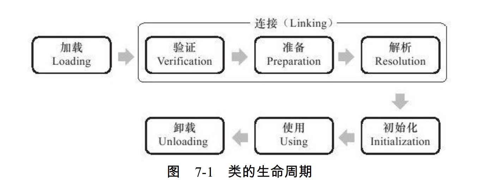
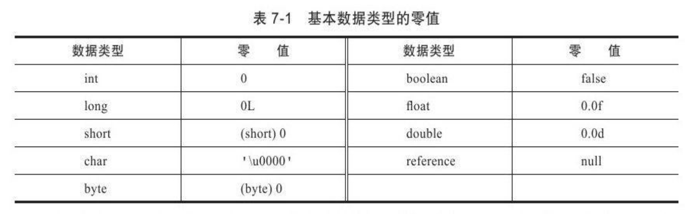
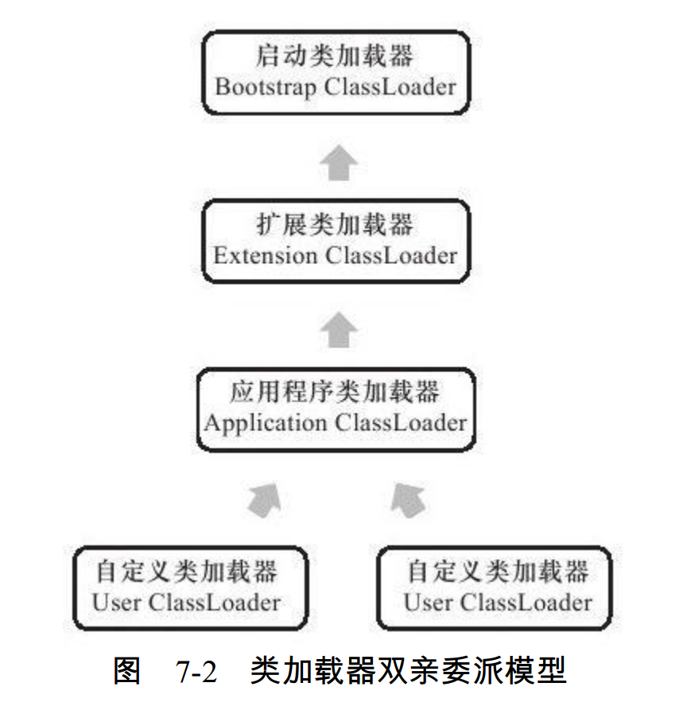
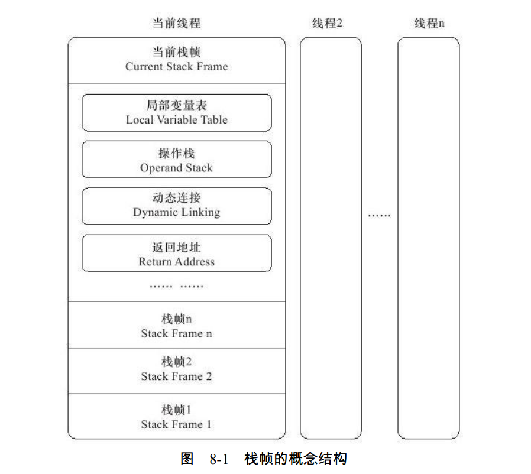
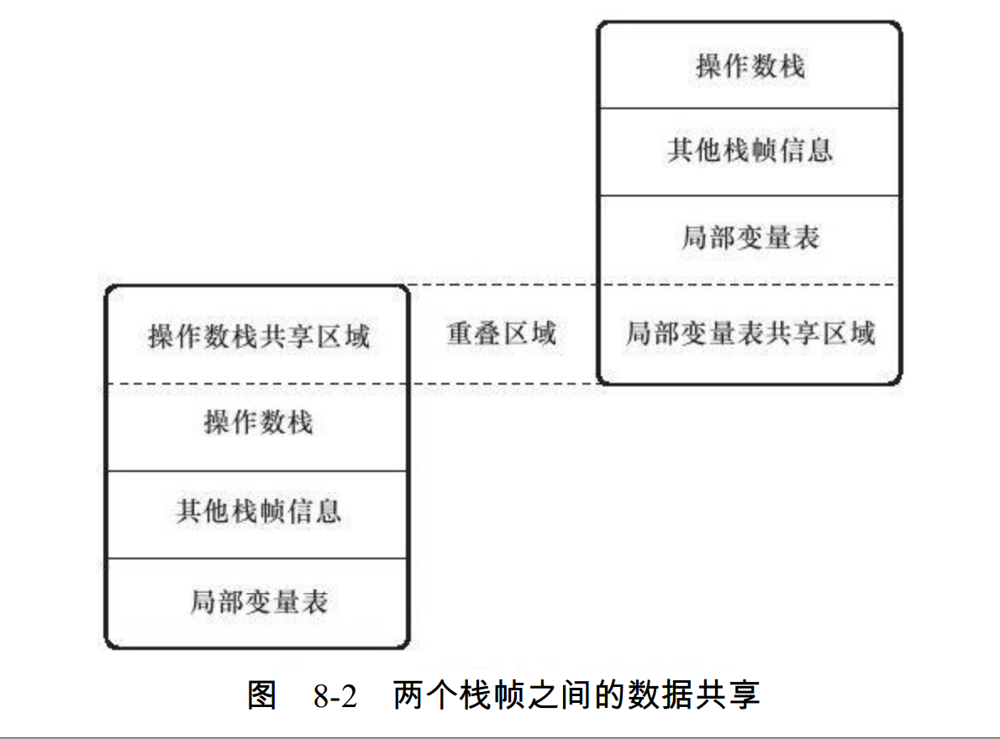
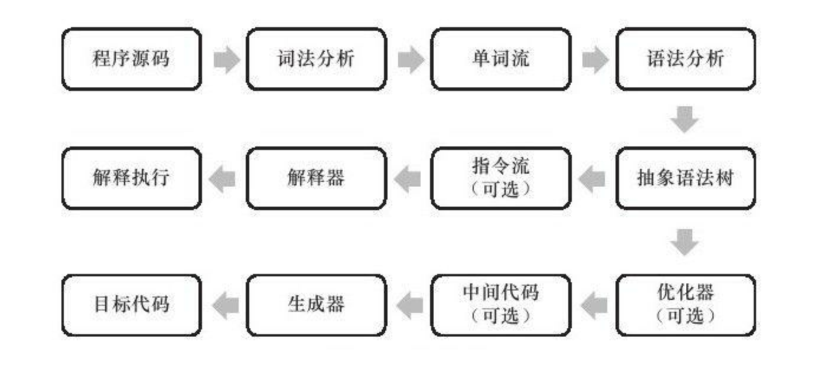

# 深入理解Java虚拟机

## 第六章 类文件结构

平台无关性、语言无关性

### 6.1 Class类文件的结构

Class文件是一组以**8位字节**为基础单位的**二进制流** 

根据Java虚拟机规范的规定，Class文件格式采用一种类似于C语言结构体的伪结构来存储数据，这种伪结构中只有两种数据类型：**无符号数**和**表** 

1. 无符号数属于**基本的数据类型**，以u1、 u2、 u4、 u8来分别代表1个字节、 2个字节、 4个字节和8个字节的无符号数，无符号数可以用来描述数字、 索引引用、 数量值或者按照UTF-8编码构成字符串值。 
2. 表是由多个无符号数或者其他表作为数据项构成的**复合数据类型**，所有表都习惯性地以“_info”结尾。 表用于描述有层次关系的复合结构的数据，整个Class文件本质上就是一张表。 

### 方法表集合

ConstantValue属性 ：

目前Sun Javac编译器的选择是：如果同时使用final和static来修饰一个变量（按照习惯，这里称“常量”更贴切），并且这个变量的数据类型是基本类型或者java.lang.String的话，就生成ConstantValue属性来进行初始化，如果这个变量没有被final修饰，或者并非基本类型及字符串，则将会选择在＜clinit＞方法中进行初始化。 


## 第七章 虚拟机类加载机制

### 7.1 概述 

虚拟机把描述类的数据从Class文件加载到内存，并对数据进行校验、 转换解析和初始化，最终形成可以被虚拟机直接使用的Java类型，这就是虚拟机的类加载机制。 

### 7.2 类加载的时机

类从被加载到虚拟机内存中开始，到卸载出内存为止，它的整个生命周期包括：加载（Loading）、 验证（Verification）、 准备（Preparation）、 解析（Resolution）、 初始化（Initialization）、 使用（Using）和卸载（Unloading）7个阶段。 其中**验证、 准备、 解析**3个部分统称为连接（Linking） 



加载、 验证、 准备、 初始化和卸载这5个阶段的顺序是确定的，类的加载过程
必须按照这种顺序按部就班地开始，而**解析阶段**则不一定：它在某些情况下可以在初始化阶段之后再开始，这是为了支持Java语言的运行时绑定（也称为动态绑定或晚期绑定）。 注意，这里笔者写的是按部就班地“开始”，而不是按部就班地“进行”或“完成”，强调这点是因为这些阶段通常都是互相交叉地混合式进行的，通常会在一个阶段执行的过程中调用、 激活另外一个阶段。 

虚拟机规范是严格规定了有且只有5种情况必须立即对类进行“初始化” 

1）遇到new、 getstatic、 putstatic或invokestatic这4条字节码指令时，如果类没有进行过初始化，则需要先触发其初始化。  

2）使用java.lang.reflect包的方法对类进行反射调用的时候，如果类没有进行过初始化，
则需要先触发其初始化。 

3）当初始化一个类的时候，如果发现其父类还没有进行过初始化，则需要先触发其父
类的初始化。 

4）当虚拟机启动时，用户需要指定一个要执行的主类（包含main（）方法的那个
类），虚拟机会先初始化这个主类。 

5）当使用JDK 1.7的动态语言支持时，如果一个java.lang.invoke.MethodHandle实例最后的解析结果REF_getStatic、 REF_putStatic、 REF_invokeStatic的方法句柄，并且这个方法句柄所对应的类没有进行过初始化，则需要先触发其初始化。  

> 接口与类真正有所区别的是前面讲述的5种“有且仅有”需要开始初始化场景中的第3种：当一个类在初始化时，要求其父类全部都已经初始化过了，但是一个接口在初始化时，并不要求其父接口全部都完成了初始化，只有在真正使用到父接口的时候（如引用接口中定义的常量）才会初始化。 

### 7.3 类加载的过程

#### 7.3.1 加载 

在加载阶段，虚拟机需要完成以下3件事情：

1. 通过一个类的全限定名来获取定义此类的二进制字节流。
2. 将这个字节流所代表的静态存储结构转化为方法区的运行时数据结构。
3. 在内存中生成一个代表这个类的java.lang.Class对象，作为方法区这个类的各种数据的访问入口。 

> 对于HotSpot虚拟机而言，Class对象比较特殊，它虽然是对象，但是存放在方法区里面 

#### 7.3.2 验证

验证是**连接阶段**的**第一步**，这一阶段的目的是为了确保Class文件的字节流中包含的信息符合当前虚拟机的要求，并且不会危害虚拟机自身的安全。

验证阶段大致上会完成下面4个阶段的检验动作：文件格式验证、
元数据验证、 字节码验证、 符号引用验证。 

#####  文件格式验证 

第一阶段要验证字节流是否符合Class文件格式的规范，并且能被当前版本的虚拟机处理。 这一阶段可能包括下面这些验证点： 

- 是否以魔数0xCAFEBABE开头。
- 主、 次版本号是否在当前虚拟机处理范围之内。 
- ......

只有通过了这个阶段的验证后， 字节流才会进入内存的方法区中进行存储，所以后面的3个验证阶段全部是基于方法区的存储结构进行的，不会再直接操作字节流。 

##### 元数据验证 

第二阶段是对字节码描述的信息进行语义分析，以保证其描述的信息符合Java语言规范的要求，这个阶段可能包括的验证点如下：

- 这个类是否有父类（除了java.lang.Object之外，所有的类都应当有父类）。
- 这个类的父类是否继承了不允许被继承的类（被final修饰的类）。
- 如果这个类不是抽象类，是否实现了其父类或接口之中要求实现的所有方法。 
- ......

##### 字节码验证 

第三阶段是整个验证过程中最复杂的一个阶段，主要目的是通过**数据流和控制流**分析，确定程序语义是合法的、 符合逻辑的。 在第二阶段对元数据信息中的数据类型做完校验后，这个阶段将对类的**方法体**进行校验分析，保证被校验类的方法在运行时不会做出危害虚拟机安全的事件 

##### 符号引用验证 

最后一个阶段的校验发生在虚拟机将符号引用转化为直接引用的时候，这个转化动作将在连接的第三阶段——解析阶段中发生。 符号引用验证可以看做是对类自身以外（常量池中的各种符号引用）的信息进行匹配性校验，通常需要校验下列内容：

- 符号引用中通过字符串描述的全限定名是否能找到对应的类。
- 在指定类中是否存在符合方法的字段描述符以及简单名称所描述的方法和字段。
- 符号引用中的类、 字段、 方法的访问性（private、 protected、 public、 default）是否可被当前类访问。 
- ......

#### 7.3.3 准备

准备阶段是正式为类变量分配内存并设置类变量初始值的阶段，这些变量所使用的内存都将在方法区中进行分配。这里所说的初始值“通常情况”下是数据类型的零值 。



在“通常情况”下初始值是零值，那相对的会有一些“特殊情况”：如果类字段
的字段属性表中存在ConstantValue属性，那在准备阶段变量value就会被初始化为
ConstantValue属性所指定的值，假设上面类变量value的定义变为： 

```java
public static final int value=123；
```

编译时Javac将会为value生成ConstantValue属性，在准备阶段虚拟机就会根据
ConstantValue的设置将value赋值为123。 

#### 7.3.4 解析

解析阶段是虚拟机将**常量池内**的**符号引用**替换为**直接引用**的过程 

- 符号引用（Symbolic References）：符号引用以一组符号来描述所引用的目标，符号可以是任何形式的字面量 。各种虚拟机实现的内存布局可以各不相同，但是它们能接受的**符号引用**必须都是**一致**的，因为符号引用的字面量形式明确定义在Java虚拟机规范Class文件格式中。 

- 直接引用（Direct References）：直接引用可以是直接指向目标的指针、 相对偏移量或是一个能间接定位到目标的句柄。  

解析动作主要针对类或接口、 字段、 类方法、 接口方法、 方法类型、 方法句柄和调用点限定符7类符号引用进行 

1. 类或接口的解析 
2. 字段解析 
3. 类方法解析 
4. 接口方法解析 

#### 7.3.5 初始化 

类初始化阶段是类加载过程的最后一步，前面的类加载过程中，除了在**加载阶段**用户应用程序可以通过自定义类加载器参与之外，其余动作**完全**由虚拟机主导和控制。 到了**初始化阶段**，才真正开始执行类中定义的Java程序代码（或者说是字节码）。 

>从另外一个角度来表达：初始化阶段是执行类构造器＜clinit＞（）方法的过程。 

＜clinit＞（）方法对于类或接口来说并不是必需的，如果一个类中没有静态语句块，也没有对变量的赋值操作，那么编译器可以不为这个类生成＜clinit＞（）方法。 

接口中不能使用静态语句块，但仍然有变量初始化的赋值操作，因此接口与类一样都会生成＜clinit＞（）方法。 <u>但接口与类不同的是，执行接口的＜clinit＞（）方法不需要先执行父接口的＜clinit＞（）方法。</u> 只有当父接口中定义的变量使用时，父接口才会初始化。 

虚拟机会保证一个类的＜clinit＞（）方法在多线程环境中被正确地加锁、 同步，如果多个线程同时去初始化一个类，那么只会有一个线程去执行这个类的＜clinit＞（）方法，其他线程都需要阻塞等待，直到活动线程执行＜clinit＞（）方法完毕。  

> 需要注意的是，其他线程虽然会被阻塞，但如果执行＜clinit＞（）方法的那条线程退出＜clinit＞（）方法后，其他线程唤醒之后不会再次进入＜clinit＞（）方法。 同一个类加载器下，一个类型只会初始化一次。 

### 7.4 类加载器

虚拟机设计团队把类加载阶段中的“通过一个类的全限定名来获取描述此类的二进制字节流”这个动作放到Java虚拟机外部去实现，以便让应用程序自己决定如何去获取所需要的类。 实现这个动作的代码模块称为“类加载器”。 

##### 7.4.1 类与类加载器 

比较两个类是否“相等”，只有在这两个类是由同一个类加载器加载的前提下才有意义，否则，即使这两个类来源于同一个Class文件，被同一个虚拟机加载，只要加载它们的类加载器不同，那这两个类就必定不相等。 

##### 7.4.2 双亲委派模型 

从Java虚拟机的角度来讲，只存在**两种**不同的类加载器：

1. 一种是启动类加载器，是**虚拟机自身的**一部分；
2. 另一种就是所有其他的类加载器，这些类加载器都由Java语言实现，独立于**虚拟机外部**，并且全都继承自抽象java.lang.ClassLoader。 

从Java开发人员的角度来看，类加载器还可以划分得更细致一些，绝大部分Java程序都会使用到以下3种系统提供的类加载器:

1. **启动类加载器** :这个类将器负责将存放在＜JAVA_HOME＞\lib目录中的，或者被-Xbootclasspath参数所指定的路径中的，并且是虚拟机识别的类库加载到虚拟机内存中。 启动类加载器**无法**被Java程序直接引用 .
2. **扩展类加载器**:它负责加载＜JAVA_HOME＞\lib\ext目录中的，或者被java.ext.dirs系统变量所指定的路径中的所有类库，开发者可以**直接使用**扩展类加载器。
3. **应用程序类加载器**:它负责加载用户类路径（ClassPath）上所指定的类库，开发者可以**直接使用**这个类加载器，如果应用程序中没有自定义过自己的类加载器，一般情况下这个就是程序中默认的类加载器。



双亲委派模型要求**除了**顶层的**启动类加载器**外，其余的类加载器都应当有自己的**父类加载器**。 这里类加载器之间的父子关系一般**不会以继承**的关系来实现，而是都使用**组合关系**来复用父加载器的代码。 

**双亲委派模型的工作过程**:

如果一个类加载器收到了类加载的请求，它首先不会自己去尝试加载这个类，而是把这个请求委派给父类加载器去完成，每一个层次的类加载器都是如此，因此所有的加载请求最终都应该传送到顶层的启动类加载器中，只有当父加载器反馈自己无法完成这个加载请求（它的搜索范围中没有找到所需的类）时，子加载器才会尝试自己去加载。 

##### 7.4.3 破坏双亲委派模型 

## 第八章 虚拟机字节码执行引擎 

执行引擎是Java虚拟机最核心的组成部分之一。 所有的Java虚拟机的执行引擎都是一致的：输入的是字节码文件，处理过程是字节码解析的等效过程，输出的是执行结果，本章将主要从概念模型的角度来讲解虚拟机的方法调用和字节码执行。 

### 8.1 运行时栈帧结构 

每一个栈帧都包括了局部变量表、 操作数栈、 动态连接、 方法返回地址和一些额外的附加信息。  

在编译程序代码的时候，栈帧中需要多大的局部变量表，多深的操作数栈都已经**完全确定**了，并且写入到方法表的Code属性之中，因此一个栈帧需要分配多少内存，**不会受到**程序运行期变量数据的影响，而仅仅取决于具体的虚拟机实现。 



#### 8.1.1 局部变量表 

局部变量表是一组变量值存储空间，用于存放方法参数和方法内部定义的局部变量。 

局部变量表的容量以变量槽（Variable Slot，下称Slot）为**最小单位** ，允许Slot的长度可以随着处理器、 操作系统或虚拟机的不同而发生变化。 

一个Slot可以存放一个**32位以内**的数据类型，Java中占用32位以内的数据类型有boolean、 byte、 char、 short、int、 float、 reference[3]和returnAddress  

对于64位的数据类型，虚拟机会以高位对齐的方式为其分配两个连续的Slot空间。Java语言中明确的（reference类型则可能是32位也可能是64位）64位的数据类型只有long和double两种。    

>由于局部变量表建立在线程的堆栈上，是线程私有的数据，无论读写两个连续的Slot是否为原子操作，都不会引起数据安全问题。

虚拟机通过**索引定位**的方式使用局部变量表，索引值的范围是从0开始至局部变量表最大的Slot数量。 如果访问的是32位数据类型的变量，索引n就代表了使用第n个Slot，如果是64位数据类型的变量，则说明会**同时使用**n和n+1两个Slot。  

> 局部变量表中第0位索引的Slot默认是用于传递方法所属对象实例的引用，在方法中可以通过关键字“this”来访问到这个隐含的参数。 

为了尽可能节省栈帧空间，局部变量表中的Slot是可以重用的，方法体中定义的变量，其作用域并不一定会覆盖整个方法体，如果当前字节码PC计数器的值已经超出了某个变量的作用域，那这个变量对应的Slot就可以交给其他变量使用。 不过，这样的设计除了节省栈帧空间以外，还会伴随一些额外的副作用，例如，在某些情况下，Slot的复用会直接影响到系统的垃圾收集行为 .

```java
public static void main（String[]args）（）{
{
    byte[]placeholder=new byte[64*1024*1024]；
}
    int a=0；//不加这句的话，上面的placeholder即使出了作用域也没有被回收，因为没有其他的变量去占有placeholder的位置
	System.gc（）；
}
```

#### 8.1.2 操作数栈 

操作数栈的每一个元素可以是任意的Java数据类型，包括long和double。 32位数据类型所占的栈容量为1，64位数据类型所占的栈容量为2。 在方法执行的任何时候，操作数栈的深度都不会超过在max_stacks数据项中设定的最大值。 

> Java虚拟机的解释执行引擎称为“基于栈的执行引擎”，其中所指的“栈”就是操作数栈。 

在大多虚拟机的实现里都会做一些优化处理，令两个栈帧出现一部分重叠。 让下面栈帧的部分操作数栈与上面栈帧的部分局部变量表重叠在一起，这样在进行方法调用时就可以共用一部分数据，无须进行额外的参数复制传递 



#### 8.1.3 动态连接 

每个栈帧都包含一个指向运行时常量池[1]中该栈帧所属方法的引用，持有这个引用是为了支持方法调用过程中的动态连接 。

#### 8.1.4 方法返回地址 

当一个方法开始执行后，只有两种方式可以退出这个方法。 

第一种方式是执行引擎遇到任意一个方法返回的字节码指令，这时候可能会有返回值传递给上层的方法调用者 ，这种退出方法的方式称为**正常完成出口**。

另外一种退出方式是，在方法执行过程中遇到了异常，并且这个异常没有在方法体内得到处理，就会导致方法退出 ，这种退出方法的方式称为异常完成出口 

#### 8.1.5 附加信息 

虚拟机规范允许具体的虚拟机实现增加一些规范里没有描述的信息到栈帧之中，例如与调试相关的信息，这部分信息完全取决于具体的虚拟机实现 

### 8.2 方法调用 

#### 8.2.1 解析

在类加载的解析阶段，会将其中的一部分符号引用转化为直接引用，这种解析能成立的前提是：方法在程序真正运行之前就有一个可确定的调用版本，并且这个方法的调用版本在运行期是不可改变的。 换句话说，调用目标在程序代码写好、 编译器进行编译时就必须确定下来。 这类方法的调用称为解析（Resolution）。 

在Java语言中符合“编译期可知，运行期不可变”这个要求的方法，主要包括静态方法和私有方法两大类 

在Java虚拟机里面提供了5条方法调用字节码指令，分别如下。
invokestatic：调用静态方法。
invokespecial：调用实例构造器＜init＞方法、 私有方法和父类方法。
invokevirtual：调用所有的虚方法。
invokeinterface：调用接口方法，会在运行时再确定一个实现此接口的对象。
invokedynamic：先在运行时动态解析出调用点限定符所引用的方法，然后再执行该方法，在此之前的4条调用指令，分派逻辑是固化在Java虚拟机内部的，而invokedynamic指令的分派逻辑是由用户所设定的引导方法决定的。 

**解析调用**一定是个**静态**的过程，在**编译期间**就完全确定，在类装载的解析阶段就会把涉及的符号引用**全部**转变为可确定的**直接引用**，不会延迟到运行期再去完成。  

**分派调用**则可能是静态的也可能是动态的，根据分派依据的宗量数[1]可分为单分派和
多分派。 这两类分派方式的两两组合就构成了静态单分派、 静态多分派、 动态单分派、 动态
多分派4种分派组合情况 

#### 8.2.2 分派 

**1.静态分派** 

静态分派的典型应用是方法重载。 静态分派发生在编译阶段，因此确定静态分派的动作实际上不是由虚拟机来执
行的。  

```java
package org.fenixsoft.polymorphic；
/**
*方法静态分派演示
*@author zzm
*/
public class StaticDispatch{
	static abstract class Human{
	}
	static class Man extends Human{
	}
	static class Woman extends Human{
	}
	public void sayHello（Human guy）{
		System.out.println（"hello,guy！"）；
	}
	public void sayHello（Man guy）{
		System.out.println（"hello,gentleman！"）；
	}
	public void sayHello（Woman guy）{
		System.out.println（"hello,lady！"）；
	}
	public static void main（String[]args）{
		Human man=new Man（）；
		Human woman=new Woman（）；
		StaticDispatch sr=new StaticDispatch（）；
		sr.sayHello（man）；
		sr.sayHello（woman）；
	}}
```

结果：

```java
hello,guy！
hello,guy！
```


把上面代码中的“Human”称为变量的静态类型，或者叫做的外观类型，后面的“Man”则称为变量的实际类型

**2.动态分派** 

由于invokevirtual指令执行的第一步就是在运行期确定接收者的实际类型，所以两次调用中的invokevirtual指令把常量池中的类方法符号引用解析到了不同的直接引用上，这个过程就是Java语言中方法重写的本质。 

```java
package org.fenixsoft.polymorphic；
/**
*方法动态分派演示
*@author zzm
*/
public class DynamicDispatch{
	static abstract class Human{
		protected abstract void sayHello（）；
	}

	static class Man extends Human{
		@Override
		protected void sayHello（）{
			System.out.println（"man say hello"）；
		}}
		
		static class Woman extends Human{
			@Override
			protected void sayHello（）{
				System.out.println（"woman say hello"）；
			}}

			public static void main（String[]args）{
				Human man=new Man（）；
				Human woman=new Woman（）；
				man.sayHello（）；
				woman.sayHello（）；
				man=new Woman（）；
				man.sayHello（）；
			}}
```

结果：

```java
man say hello
woman say hello
woman say hello
```

3.单分派与多分派 

方法的**接收者**与**方法的参数**统称为方法的宗量 

```java
/**
*单分派、 多分派演示
*@author zzm
*/
public class Dispatch{
	static class QQ{}
	static class_360{}
	public static class Father{

		public void hardChoice（QQ arg）{
			System.out.println（"father choose qq"）；
		}
		public void hardChoice（_360 arg）{
			System.out.println（"father choose 360"）；
		}
	}

	public static class Son extends Father{
			
		public void hardChoice（QQ arg）{
				System.out.println（"son choose qq"）；
			}
			public void hardChoice（_360 arg）{
				System.out.println（"son choose 360"）；
			}}

			public static void main（String[]args）{
				Father father=new Father（）；
				Father son=new Son（）；
				father.hardChoice（new_360（））；
				son.hardChoice（new QQ（））；
			}
	}
```

结果：

```java
father choose 360
son choose qq
```

总结：今天的Java语言是一门静态多分派、 动态单分派的语言。  

**4.虚拟机动态分派的实现** 

由于动态分派是非常频繁的动作，而且动态分派的方法版本选择过程需要运行时在类的方法元数据中搜索合适的目标方法，因此在虚拟机的实际实现中基于性能的考虑，大部分实现都不会真正地进行如此频繁的搜索。 面对这种情况，最常用的“稳定优化”手段就是为类在方法区中建立一个**虚方法表** 。

方法表一般在类加载的连接阶段进行初始化，准备了类的变量初始值后，虚拟机会把该类的方法表也初始化完毕。 

#### 8.3 .3动态类型语言支持 

动态类型语言的关键特征是它的类型检查的主体过程是在运行期而不是编译期 。

>Java的连接过程不在编译阶段，而在类加载阶段 

......

### 8.3 基于栈的字节码解释执行引擎 

#### 8.3.1 解释执行 

如今，基于物理机、 Java虚拟机，或者非Java的其他高级语言虚拟机（HLLVM）的语言，大多都会遵循这种基于现代经典编译原理的思路，在执行前先对程序源码进行词法分析和语法分析处理，把源码转化为抽象语法树 



Java语言中，Javac编译器完成了程序代码经过词法分析、 语法分析到抽象语法树，再遍历语法树生成线性的字节码指令流的过程。 因为这一部分动作是在Java虚拟机之外进行的，而解释器在虚拟机的内部，所以Java程序的编译就是半独立的实现。 

#### 8.3.2 基于栈的指令集与基于寄存器的指令集 

基于栈的指令集

"1+1"

```java
iconst_1
iconst_1
iadd
istore_0
```

**优点：**

1. 主要的**优点**就是可移植
2. 代码相对更加紧凑（字节码中每个字节就对应一条指令，而多地址指令集中还需要存放参数） 
3. 编译器实现更加简单  （不需要考虑空间分配的问题，所需空间都在栈上操作） 

**缺点：**

1. 主要**缺点**是执行速度相对来说会稍慢一些
2. 完成相同功能所需的指令数量一般会比寄存器架构多


基于寄存器的指令集 

"1+1"

```java
mov eax，1
add eax，1
```

#### 8.3.3 基于栈的解释器执行过程 

在第6、 7、 8三章中，我们针对Java程序是如何存储的、 如何载入（创建）的，以及如何执行的问题把相关知识进行了讲解 