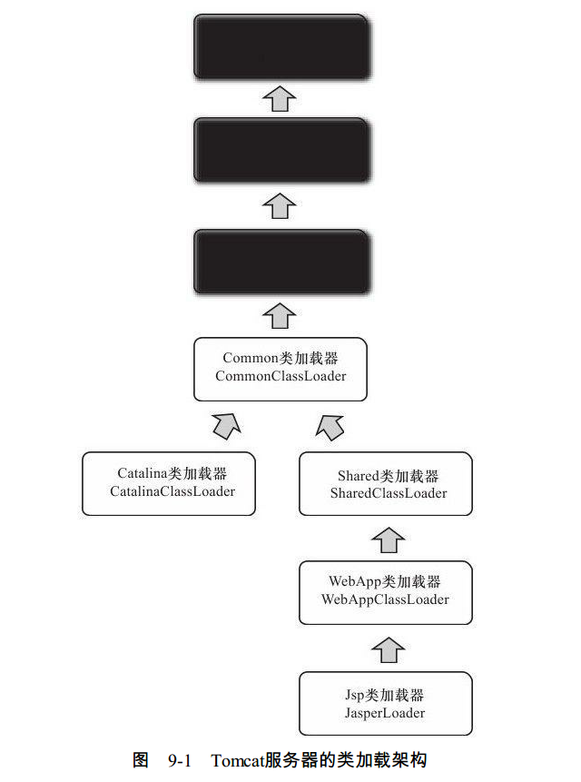
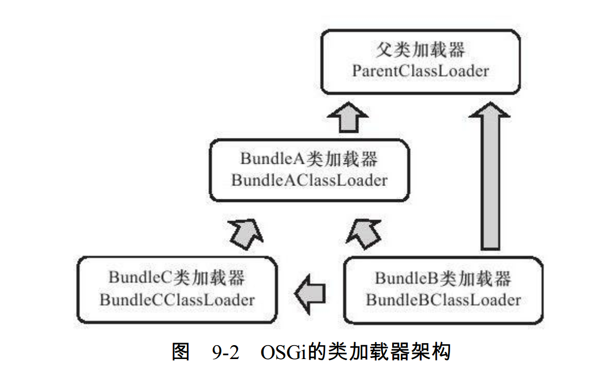

# 深入理解Java虚拟机

## 第九章 类加载及执行子系统的案例与实战 

### 9.1 案例分析

#### 9.1.1 Tomcat：正统的类加载器架构 

在Tomcat目录结构中，有3组目录（“/common/*”、 “/server/*”和“/shared/*”）可以存放Java类库，另外还可以加上Web应用程序自身的目录“/WEB-INF/*”，一共4组，把Java类库放置在这些目录中的含义分别如下：

- 放置在/common目录中：类库可被Tomcat和所有的Web应用程序共同使用。
- 放置在/server目录中：类库可被Tomcat使用，对所有的Web应用程序都不可见。
- 放置在/shared目录中：类库可被所有的Web应用程序共同使用，但对Tomcat自己不可
  见。
- 放置在/WebApp/WEB-INF目录中：类库仅仅可以被此Web应用程序使用，对Tomcat和其
  他Web应用程序都不可见。 

为了支持这套目录结构，并对目录里面的类库进行加载和隔离，Tomcat自定义了多个类加载器，这些类加载器按照经典的双亲委派模型来实现，其关系如图9-1所示。 

CommonClassLoader、 CatalinaClassLoader、 SharedClassLoader和WebappClassLoader则是Tomcat自己定义的类加载器，它们分别加载/common/*、 /server/*、/shared/*和/WebApp/WEB-INF/*中的Java类库。 

#### 9.1.2 OSGi：灵活的类加载器架构 

OSGi中的每个模块（称为Bundle）与普通的Java类库区别并不太大，两者一般都以JAR格式进行封装，并且内部存储的都是Java Package和Class。 但是一个Bundle可以声明它所依赖的Java Package（通过Import-Package描述），也可以声明它允许导出发布的JavaPackage（通过Export-Package描述）。  

假设：存在Bundle A、 Bundle B、 Bundle C三个模
块，并且这三个Bundle定义的依赖关系如下。
Bundle A：声明发布了packageA，依赖了java.*的包。
Bundle B：声明依赖了packageA和packageC，同时也依赖了java.*的包。
Bundle C：声明发布了packageC，依赖了packageA。
那么，这三个Bundle之间的类加载器及父类加载器之间的关系如图 

类加载时可能进行的查找规则如下：
以java.*开头的类，委派给父类加载器加载。
否则，委派列表名单内的类，委派给父类加载器加载。
否则，Import列表中的类，委派给Export这个类的Bundle的类加载器加载。
否则，查找当前Bundle的Classpath，使用自己的类加载器加载。
否则，查找是否在自己的Fragment Bundle中，如果是，则委派给Fragment Bundle的类加
载器加载。
否则，查找Dynamic Import列表的Bundle，委派给对应Bundle的类加载器加载。
否则，类查找失败。 

>这种网状的类加载器架构在带来更好的灵活性的同时，也可能会产生许多新的隐患。 比如互相依赖，死锁。

#### 9.1.3 字节码生成技术与动态代理的实现 

generateProxyClass（）方法具体是如何产生代理类“$Proxy0.class”的字节码的，大致的生成过程其实就是根据Class文件的格式规范去拼装字节码，但在实际开发中，以byte为单位直接拼装出字节码的应用场合很少见，这种生成方式也只能产生一些高度模板化的代码。 对于用户的程序代码来说，如果有要大量操作字节码的需求，还是使用封装好的字节码类库比较合适。  

#### 9.1.4 Retrotranslator：跨越JDK版本 

## 第十章 早期（编译期）优化 

### 10.1 概述

Java语言的“编译期”其实是一段“不确定”的操作过程，因为它可能是指一个前端编译器（其实叫“编译器的前端”更准确一些）把*.java文件转变成*.class文件的过程；也可能是指虚拟机的后端运行期编译器（JIT编译器，Just In Time Compiler）把字节码转变成机器码的过程；还可能是指使用静态提前编译器（AOT编译器，Ahead Of Time Compiler）直接把*.java文件编译成本地机器代码的过程。 下面列举了这3类编译过程中一些比较有代表性的编译器。 