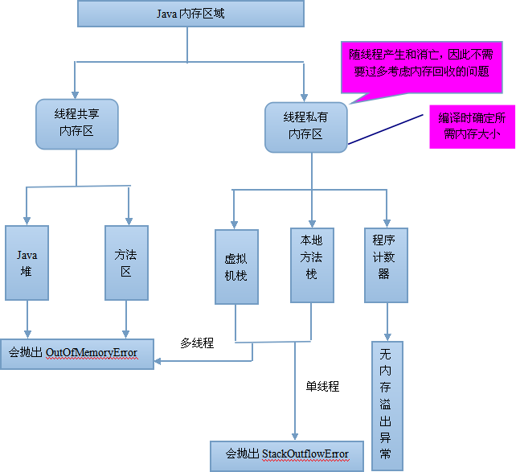
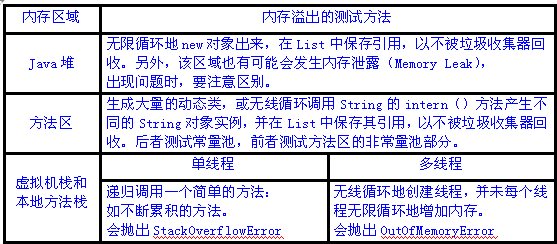
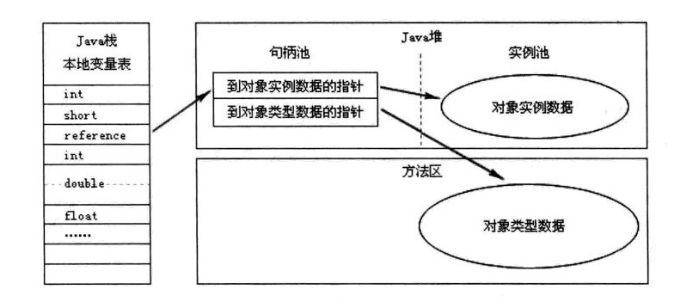
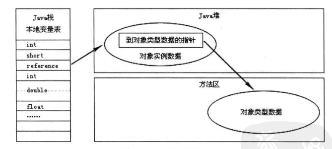

# 深入理解Java虚拟机

## 第一章 走进Java

### 1.概论


我们可以吧**Java程序设计语言**、**Java虚拟机**、**Java API类库**这三部分统称为JDK（Java Development Kit），JDK是用于支持Java程序开发的**最小环境**。

可以把Java API类库中的**Java SE API 子集**和**Java虚拟机**这两部分统称为JRE（Java Runtime Environment）JRE是支持Java程序运行的**标准环境。**

## 第二章 Java 内存区域与内存溢出异常

Java虚拟机所管理的内存将会包括以下几个运行时数据区域：



###  1、程序计数器

​	当线程在执行一个 **Java 方法**时，该计数器记录的是正在执行的虚拟机字节码指令的地址，当线程在执行的是 **Native 方法**（调用本地操作系统方法）时，该计数器的值为**空**。

​	另外，该内存区域是唯一一个在 Java 虚拟机规范中**没有**规定任何 OOM（内存溢出：OutOfMemoryError）情况的区域。

​	每条线程都有一个独立的的程序计数器

### 2、Java虚拟机栈

​	虚拟机栈描述的是 **Java 方法**执行的内存模型：每个方法被执行的时候都会同时创建一个栈帧，栈是用于支持续虚拟机进行**方法调用**和**方法执行**的数据结构。

> 在**单线程**的操作中，虚拟机抛出的都是 **StackOverflowError 异常**
>
> 而在**多线程**环境下，则会抛出 **OutOfMemoryError 异常**。
>
> 

**栈帧中所存放的各部分信息的作用和数据结构**

#### 2.1 局部变量表

​	局部变量表是一组变量值存储空间，用于存放**方法参数**和**方法内部定义的局部变量**，其中存放的数据的类型是编译期可知的各种基本数据类型、对象引用（reference）和 returnAddress 类型（它指向了一条字节码指令的地址）。其中64位长度的long和double类型的数据会占用2个局部变量空间（Slot），其余的数据类型只占用1个。局部变量表所需的内存空间在**编译期间**完成分配，当进入一个方法时，这个方法需要在帧中分配多大的局部变量空间是**完全确定**的，在方法运行期间**不会改变**局部变量表的大小。

#### 2.2 操作数栈

​	操作数栈又常被称为操作栈，操作数栈的最大深度也是在编译的时候就确定了。当一个方法开始执行时，它的操作栈是空的，在方法的执行过程中，会有各种字节码指令（比如：加操作、赋值元算等）向操作栈中写入和提取内容，也就是入栈和出栈操作。

> 基于栈的指令集最主要的优点是可移植性强，主要的缺点是执行速度相对会慢些；(Java虚拟机)
>
> 而由于寄存器由硬件直接提供，所以基于寄存器指令集最主要的优点是执行速度快，主要的缺点是可移植性差；（Android 虚拟机）

#### 2.3 动态链接

​	每个栈帧都包含一个指向运行时常量池（在方法区中，后面介绍）中该栈帧所属方法的引用，持有这个引用是为了支持方法调用过程中的动态连接。Class 文件的常量池中存在有大量的符号引用，字节码中的方法调用指令就以常量池中指向方法的符号引用为参数。这些符号引用，一部分会在类加载阶段或第一次使用的时候转化为直接引用（如 final、static 域等），称为静态解析，另一部分将在每一次的运行期间转化为直接引用，这部分称为动态连接。

#### 2.4 方法返回地址

​	方法退出的过程实际上等同于把当前栈帧出站，因此退出时可能执行的操作有：恢复上层方法的局部变量表和操作数栈，如果有返回值，则把它压入调用者栈帧的操作数栈中，调整 PC 计数器的值以指向方法调用指令后面的一条指令。

### 3、本地方法栈

​	该区域与虚拟机栈所发挥的作用非常相似，只是虚拟机栈为虚拟机执行 Java 方法服务，而本地方法栈则为使用到的本地操作系统（Native）方法服务，会抛出StackOverflowError和OutOfMemoryError异常。（Sun HotSpot虚拟机把本地方法栈和虚拟机栈合二为一）

### 4、Java堆

​	Java Heap 是 Java 虚拟机所管理的内存中最大的一块，它是所有线程共享的一块内存区域。几乎所有的对象实例和数组都在这类分配内存。Java Heap 是垃圾收集器管理的主要区域，因此很多时候也被称为“GC堆”。

​	根据 Java 虚拟机规范的规定，Java 堆可以处在物理上不连续的内存空间中，只要逻辑上是连续的即可。如果在堆中没有内存可分配时，并且堆也无法扩展时，将会抛出 OutOfMemoryError 异常。

​	Java堆可以处于物理上不连续的内存空间中。

### 5、方法区

​	方法区也是各个线程共享的内存区域，它用于存储已经被虚拟机加载的类信息、常量、静态变量、即时编译器编译后的代码等数据。方法区域又被称为“永久代”，但这仅仅对于 Sun HotSpot 来讲，JRockit 和 IBM J9 虚拟机中并不存在永久代的概念。

### 5.1 运行时常量池

运行时常量池是方法区的一部分，用于存放编译器生成的各种字面量和符号引用，这部分内容将在类加载后进入方法区的运行时产量池中存放。

> Java 语言并不要求常量一定只能在编译期产生，也就是并非预置入 Class 文件中的常量池的内容才能进入方法区的运行时常量池，运行期间也可能将新的常量放入池中，这种特性被开发人员利用比较多的是 String 类的 intern（）方法。


### 6、直接内存

​	直接内存并不是虚拟机运行时数据区的一部分，也不是 Java 虚拟机规范中定义的内存区域，它直接从操作系统中分配，因此不受 Java 堆大小的限制，但是会受到本机总内存的大小及处理器寻址空间的限制，因此它也可能导致 OutOfMemoryError 异常出现。

### 7、内存溢出的测试方法



### 8、内存泄漏和内存溢出的区别

​	内存泄露是指分配出去的内存没有被回收回来，由于失去了对该内存区域的控制，因而造成了资源的浪费。Java 中一般不会产生内存泄露，因为有垃圾回收器自动回收垃圾，但这也不绝对，当我们 new 了对象，并保存了其引用，但是后面一直没用它，而垃圾回收器又不会去回收它，这边会造成内存泄露，

​	内存溢出是指程序所需要的内存超出了系统所能分配的内存（包括动态扩展）的上限。


### 9、HotSpot虚拟机对象探秘

#### 9.1 对象的创建

​	在类加载检查通过后，接下来虚拟机将为新生对象分配内存。

- 假设Java堆中的内存是足够规整的，所有用过的内存放一边，没用过的内存放一边，中间放着一个指针作为分界点的指示器，那所分配内存就仅仅是把那个指针向空闲的空间挪动一段与对象大小相等的距离，这种方式称为“指针碰撞”。
- 如果Java堆内存不是规整的，虚拟机就必须维护一个列表，记录哪些内存块是可以用的，并在分配后更新列表记录。这种方式称为“空闲列表”

> 选择哪种方式由Java堆是否规整决定，而是否规整又由垃圾收集器是否带有压缩整理功能决定。

除如何划分可用空间之外，还有另外一个需要考虑的问题是对象创建在虚拟机中是非常频繁的行为，即使是仅仅修改一个指针所指向的位置，在并发情况下也并不是线程安全的，可能出现正在给对象A分配内存，指针还没来得及修改，对象B又同时使用了原来的指针来分配内存的情况。 解决这个问题有两种方案，一种是对分配内存空间的动作进行同步处理——实际上虚拟机采用CAS配上失败重试的方式保证更新操作的原子性；另一种是把内存分配的动作按照线程划分在不同的空间之中进行，即每个线程在Java堆中预先分配一小块内存，称为本地线程分配缓冲（Thread Local Allocation Buffer,TLAB）。 哪个线程要分配内存，就在哪个线程的TLAB上分配，只有TLAB用完并分配新的TLAB时，才需要同步锁定。虚拟机是否使用TLAB，可以通过-XX：+/-UseTLAB参数来设定。 

接下来，虚拟机要对对象进行必要的设置，例如这个对象是哪个类的实例、 如何才能找到类的元数据信息、 对象的哈希码、 对象的GC分代年龄等信息。 这些信息存放在对象的对象头（Object Header）之中。  

#### 9.2 对象的内存布局

在HotSpot虚拟机中，对象在内存中存储的布局可以分为3块区域：对象头（Header）、实例数据（Instance Data）和对齐填充（Padding）。

##### 9.2.1 对象头

HotSpot虚拟机的对象头包括**两部分**信息：

第一部分用于存储对象自身的运行时数据，如哈希码（HashCode）、 GC分代年龄、 锁状态标志、 线程持有的锁、 偏向线程ID、 偏向时间戳等 

另外一部分是类型指针，即对象指向它的**类元数据**的指针，虚拟机通过这个指
针来确定这个对象是哪个类的实例。  

> 如果对象是一个Java数组，那在对象头中还必须有一块用于记录数组长度的数据 

##### 9.2.2 实例数据

实例数据部分是对象真正存储的有效信息，也是在程序代码中所定义的各种类
型的字段内容。 无论是从父类继承下来的，还是在子类中定义的，都需要记录起来。 

##### 9.2.3 对齐填充

对齐填充并不是必然存在的，也没有特别的含义，它仅仅起着占位符的作用。
由于HotSpot VM的自动内存管理系统要求对象起始地址必须是8字节的整数倍，换句话说，就是对象的大小必须是8字节的整数倍。 而对象头部分正好是8字节的倍数（1倍或者2倍），因此，当对象实例数据部分没有对齐时，就需要通过对齐填充来补全。 

#### 9.3 对象访问

对内存分配情况分析最常见的示例便是对象实例化:

```java
Object obj = new Object();
```

这段代码的执行会涉及 **Java 栈、Java 堆、方法区**三个最重要的内存区域。假设该语句出现在方法体中，及时对 JVM 虚拟机不了解的 Java 使用这，应该也知道 obj 会作为引用类型（reference）的数据保存在 Java 栈的本地变量表中，而会在 Java 堆中保存该引用的实例化对象，但可能并不知道，Java 堆中还必须包含能查找到此对象类型数据的地址信息（如对象类型、父类、实现的接口、方法等），这些类型数据则保存在方法区中。

另外，由于 reference 类型在 Java 虚拟机规范里面只规定了一个指向对象的引用，并没有定义这个引用应该通过哪种方式去定位，以及访问到 Java 堆中的对象的具体位置，因此不同虚拟机实现的对象访问方式会有所不同，主流的访问方式有两种：使用**句柄池**和**直接使用指针**。

通过**句柄池**访问的方式如下：



通过**直接指针**访问的方式如下：



这两种对象的访问方式各有优势，使用句柄访问方式的最大好处就是 reference 中存放的是**稳定的句柄地址**，在对象被移动（垃圾收集时移动对象是非常普遍的行为）时只会改变句柄中的实例数据指针，而 reference 本身不需要修改。使用直接指针访问方式的最大好处是**速度快**，它节省了一次指针定位的时间开销。目前 Java 默认使用的 HotSpot 虚拟机采用的便是是**第二种方式**进行对象访问的。