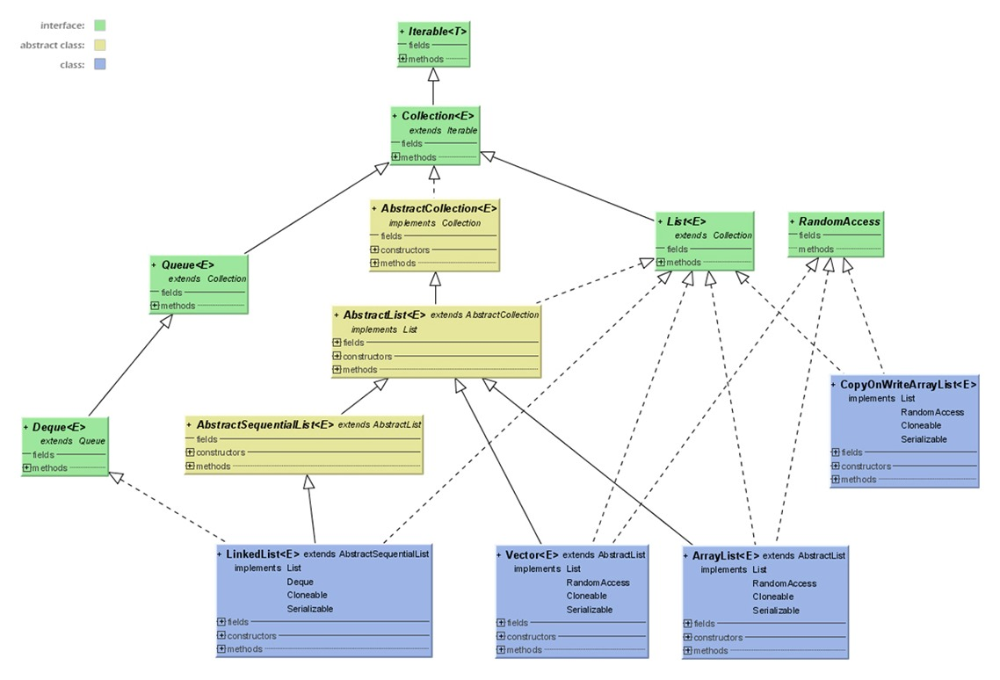
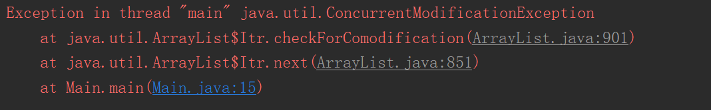
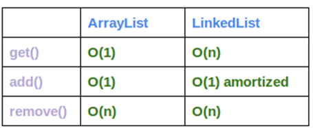

# ArrayList,LinkedList和Vector比较


## 一、List 回顾

序列（List），有序的Collection，正如它的名字一样，是一个有序的元素列表。确切的讲，**列表通常允许满足 e1.equals(e2) 的元素对 e1 和 e2**，并且如果列表本身允许 null 元素的话，通常它们允许多个 null 元素。实现List的有：ArrayList、LinkedList、Vector、Stack等。



## 二、ArrayList vs Vector

ArrayList是一个可调整大小的数组实现的序列。随着元素增加，其大小会动态的增加。<u>此类在Iterator或ListIterator迭代中，调用容器自身的remove和add方法进行修改，会抛出**ConcurrentModificationException**并发修改异常。</u>

**注意，此实现不是同步的。**如果多个线程同时访问一个 `ArrayList` 实例，而其中至少一个线程从结构上修改了列表，那么它*必须* 保持外部同步。（结构上的修改是指任何添加或删除一个或多个元素的操作，或者显式调整底层数组的大小；仅仅设置元素的值不是结构上的修改。）这一般通过对自然封装该列表的对象进行同步操作来完成。如果不存在这样的对象，则应该使用 `Collections.synchronizedList` 方法将该列表“包装”起来。这最好在创建时完成，以防止意外对列表进行不同步的访问：

```java
List list = Collections.synchronizedList(new ArrayList(...));
```

### 演示

下面演示下在**ConcurrentModificationException**的出现，及处理方案。

```java
import java.util.*;

public class Main {

    public static void main(String[] args) {
       List<String> list = new ArrayList<>();
       list.add("ddd");
       list.add("aaa");
       list.add("bbb");
       list.add(null);
       list.add(null);
       list.add(1,"123");
       Iterator it = list.iterator();
       while (it.hasNext()){
           if(it.next().equals("aaa")){
               list.add("ccc");
           }
       }
        System.out.println(list);
    }
}

```

报错：



怎么解决的，先看清楚这个问题。问题描述很清楚，**在创建迭代器之后，除非通过迭代器自身的 remove 或 add 方法从结构上对列表进行修改，否则在任何时间以任何方式对列表进行修改，迭代器都会抛出 ConcurrentModificationException。**

因此我们应该这样修改代码，用ListIterator迭代器提供方法：

```java
import java.util.*;

public class Main {

    public static void main(String[] args) {
       List<String> list = new ArrayList<>();
       list.add("ddd");
       list.add("aaa");
       list.add("bbb");
       list.add(null);
       list.add(null);
       list.add(1,"123");
       ListIterator it = list.listIterator();
       while (it.hasNext()){
           Object o = it.next();
           if("aaa".equals(o)){
               it.remove();
           }
       }
        System.out.println(list);
    }
}

```

## 三、 LinkedList及其与ArrayList性能比较

LinkedList与ArrayList一样实现List接口，LinkedList是List接口链表的实现。基于链表实现的方式使得LinkedList在插入和删除时更优于ArrayList，而随机访问则比ArrayList逊色些。LinkedList实现所有可选的列表操作，并允许所有的元素包括null。除了实现 List 接口外，LinkedList 类还为在列表的开头及结尾 get、remove 和 insert 元素提供了统一的命名方法。这些操作允许将链接列表用作**堆栈、队列或双端队列**。

LinkedList和ArrayList的方法时间复杂度总结如下图所示。



**LinkedList在添加和删除中性能快，但在获取中性能差。**

## 四、总结

### Vector和ArrayList

1、vector是线程同步的，所以它也是线程安全的，而arraylist是线程异步的，是不安全的。

2、记住并发修改异常 java.util.ConcurrentModificationException ，优先考虑ArrayList，除非你在使用多线程所需。

### Aarraylist和Linkedlist
1、对于随机访问get和set，ArrayList觉得优于LinkedList，LinkedList要移动指针。
2、于新增和删除操作add和remove，LinedList比较占优势，ArrayList要移动数据。
3、
<u>单条数据插入或删除，ArrayList的速度反而优于LinkedList.</u>**原因是：LinkedList的数据结构是三个对象，组大小恰当就会比链表快吧，直接赋值就完了，不用再设置前后指针的值。**
若是批量随机的插入删除数据，LinkedList的速度大大优于ArrayList. 因为ArrayList每插入一条数据，要移动插入点及之后的所有数据。