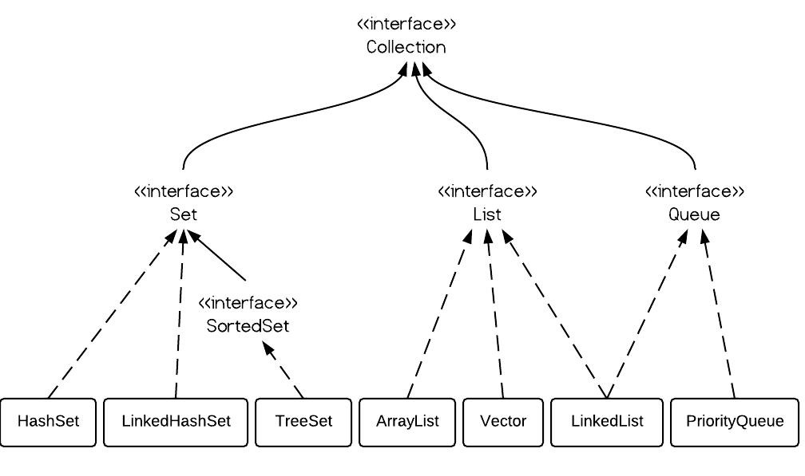
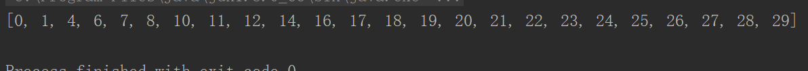
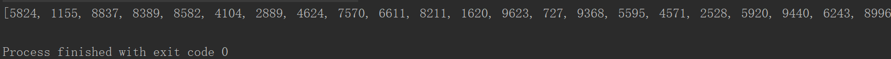
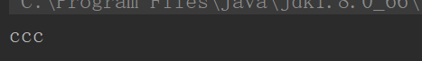
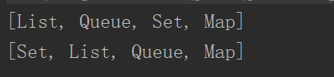
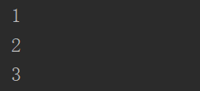
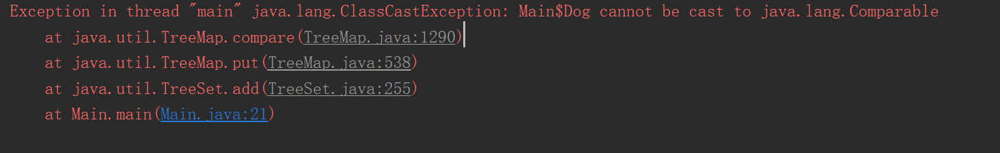

# HashSet,TreeSet和LinkedHashSet比较

## 一、Set回顾

一个**不包括重复元素（包括可变对象）**的Collection，是一种**无序**的集合。Set不包含满足 a.equals(b) 的元素对a和b，并且最多有一个null。

1、**不允许**包含**相同**元素

2、判断对象是否相同，根据**equals**方法



### 无序测试

#### 测试一

```java
import java.util.*;

public class Main {

    public static void main(String[] args) {
        Set<Integer> set = new HashSet<>();
        Random r = new Random();
        for(int i=0;i<30;i++){
            set.add(r.nextInt(30));
        }
        System.out.println(set);
    }
}

```

结果：



#### 测试二

```java
import java.util.*;

public class Main {

    public static void main(String[] args) {
        Set<Integer> set = new HashSet<>();
        Random r = new Random();
        for(int i=0;i<30;i++){
            set.add(r.nextInt(9999));
        }
        System.out.println(set);
    }
}

```

结果：



由此结果可以看出测试一的结果看似有序；其实只是Hash Code的算法上的巧合；在小范围内给人以**有序的假象**；

而在看测试二的结果可以看出不是按照普通的升序排列；也并不是无序；而是**按照Hash Code值进行的排序**；

## 二、HashSet

一个按着Hash算法来存储集合中的元素，其元素值可以是NULL。它不能保证元素的排列顺序。同样，HashSet是不同步的，如果需要多线程访问它的话，可以用 Collections.synchronizedSet 方法来包装它：

```java
Set s = Collections.synchronizedSet(new HashSet(...));
```

要注意的地方是，HashSet集合判断两个元素相等不单单是**equals**方法，并且必须**hashCode**()方法返回值也要相等。看下面的例子：

```java
import java.util.*;

public class Main {
    static class boy {
        String name;
        public boy(String name) {
            this.name = name;
        }
        @Override
        public boolean equals(Object obj) {
            return true;
        }
        @Override
        public int hashCode() {
            return super.hashCode();
        }
        /**
        public int hashCode() {
            return 1;
        }
        **/
    }
    public static void main(String[] args) {
        Set<boy> set = new HashSet<>();
        set.add(new boy("a"));
        set.add(new boy("b"));
        System.out.println(set);
    }
}

```

**必须要同时满足**

1. equals方法返回true
2. hashCode方法返回的值相同

**set才会认为这是同一个元素，并且保存的是前一个元素，后加的元素直接忽略。**

用HashSet添加可变对象，要注意当对象有可能修改后和其他对象矛盾，这样我们无法从HashSet找到准确我们需要的对象。

```java
 public static void main(String[] args) {
        Set<boy> set = new HashSet<>();
        boy bb = new boy("a");
        set.add(bb);
        set.add(new boy("b"));
        bb.setName("ccc");
        System.out.println(set.iterator().next().getName());
    }
```



## 三、LinkedHashSet

**HashSet的子类**，也同样有HashCode值来决定元素位置。但是它使用链表维护元素的次序。记住两个字：**有序**(存取有序)。

测试代码如下：

```java
import java.util.*;

public class Main {
    public static void main(String[] args) {
        Set<String> lset = new LinkedHashSet<>();
        Set<String> hset = new HashSet<>();
        lset.add("List");
        lset.add("Queue");
        lset.add("Set");
        lset.add("Map");

        hset.add("List");
        hset.add("Queue");
        hset.add("Set");
        hset.add("Map");
        System.out.println(lset);
        System.out.println(hset);
    }
}

```

输出：



## 四、TreeSet

TreeSet使用树结构实现（红黑树），集合中的元素进行排序，但是添加、删除和包含的算法复杂度为O（log（n））。

举个例子吧，首先我们定义一个Dog类。

```java
import java.util.*;

public class Main {
    static class Dog implements Comparable<Dog>{
        int age;

        public Dog(int age) {
            this.age = age;
        }

        public int getAge() {
            return age;
        }

        public void setAge(int age) {
            this.age = age;
        }

        @Override
        public int compareTo(Dog o) {
            return age-o.age;
        }
    }
    public static void main(String[] args) {
        Set<Dog> dogs = new TreeSet<>();
        dogs.add(new Dog(3));
        dogs.add(new Dog(1));
        dogs.add(new Dog(2));
        Iterator it = dogs.iterator();
        while(it.hasNext()){
            Dog dog = (Dog) it.next();
            System.out.println(dog.age);
        }
    }
}

```

输出：



TreeSet是排序的。所以Dog需要实现Comparable此接口，否则报如下的错误：



java.lang.Comparable此接口强行对实现它的每个类的对象进行整体排序。这种排序被称为类的*自然排序*，类的 `compareTo` 方法被称为它的*自然比较方法*。

## 五、总结

HashSet：equlas hashcode

LinkedHashSet：链式结构

TreeSet：比较，Comparable接口，性能较差