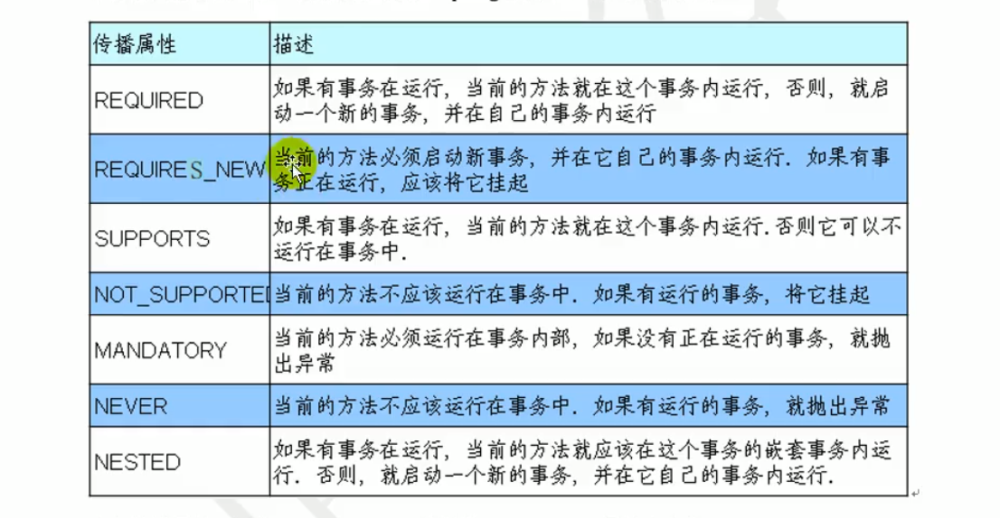
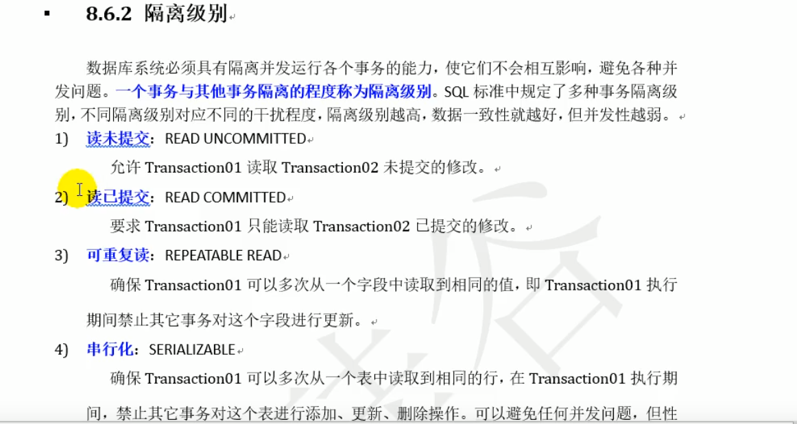
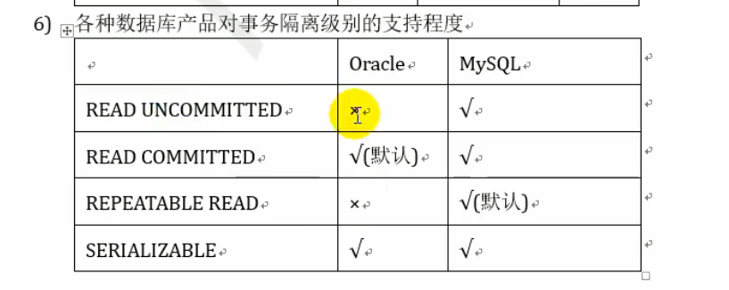

## 一、单例模式

饿汉式：直接创建对象，**不存在线程安全问题**

- 直接实例化饿汉式（简洁直观）
- 枚举式（最简洁）
- 静态代码快饿汉式（适合复制实例化，比如从配置文件中读取）

懒汉式：延迟创建对象（getInstance)

- 线程不安全（适用于单线程）
- 线程安全（加锁，适用于多线程）
- 静态内部类形式（静态内部类只有用到的时候才创建，适用于多线程）

## 二、类初始化和实例初始化

### 1.类初始化过程

- 一个类初始化就是执行<clinit>()方法

- 一个类要创建实例需要先加载并初始化该类

  > main 方法所在的类需要先加载和初始化

- 一个子类要初始化需要先初始化父类

  > <clinit>()方法由**静态类变量**显示赋值代码和**静态代码块**组成。
  >
  > 类变量显示赋值代码和静态代码块代码从上到下执行

- <clinit>()方法只执行一次

### 2. 实例初始化过程

- 实例初始化就是执行<init>()方法
  - <init>()方法可能重载有多个，有几个构造器就有几个<init>()方法
  - <init>()方法由**非静态实例**变量显示复制代码和**非静态代码块**、对应**构造器**代码组成。
  - 从上到下执行，**构造器代码最后执行**。
  - <init>()方法的首行是super()，及对应的父类的<init>()方法

> 非静态方法前面其实有一个默认的对象this
>
> this在构造器（或<init>()方法）他表示的是正在创建的对象，因为这里是创建Son对象，所以test()执行的是子类重写的代码。
>
> final方法、静态方法、private等子类中不可见的方法不能被重写。

## 三、事务

#### 1. 事务的传播行为

#### 2. 事务的隔离级别

