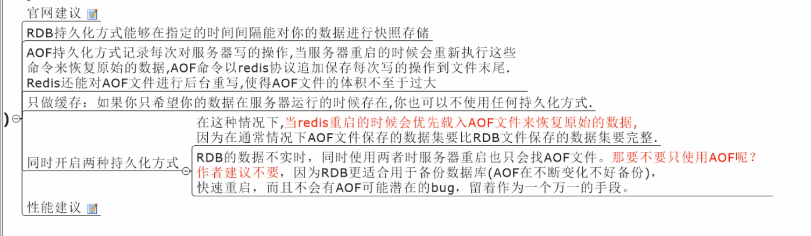
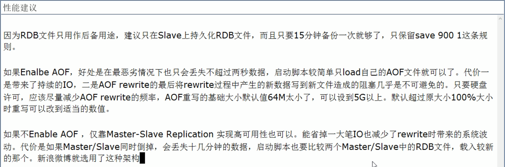

# Redis学习

REmote DIctionary Server(Redis) 是一个由Salvatore Sanfilippo写的key-value存储系统。它通常被称为数据结构服务器，因为值（value）可以是 字符串(String), 哈希(Hash), 列表(list), 集合(sets) 和 有序集合(sorted sets)等类型。

## 一、三大特点

- Redis支持数据的持久化，可以将内存中的数据保存在磁盘中，重启的时候可以再次加载进行使用。
- Redis不仅仅支持简单的key-value类型的数据，同时还提供list，set，zset，hash等数据结构的存储。
- Redis支持数据的备份，即master-slave模式的数据备份。

## 二、五大数据类型

各种类型的命令参考：[](http://doc.redisfans.com/)

### 建（Key）

常用：

- keys *   查看当前库的所有key
- exists key的名字  判断某个key是否存在
- move key db    把这个key剪切到另一个库
- expire key 秒钟     为给定的key设置过期时间
- ttl key  查看还有多少秒过期，-1表示永不过期，-2表示已过期
- type key    查看key的类型

### 1.字符串（Sting）

- set/get/del/append/strlen 
- incr/decr/incrby/decrby   对数字加减，一定要是数字，否则报错
- getrange/setrange  部分获得字符串和部分设置字符串
- setex(set with expire)  设置存活时间，例：setex k1 10 v1 设置k1存活10秒
- setnx(set if not exist) 如果不存在就设值
- mset 多个值一起设置，例：mset k1 v1 k2 v2 
- mget 多个值一起获取，例：mget k1 k2
- msetnx 当要设置的值全部不存在的时候才一起设置，例：msetnx k1 v1 k2 v2 

### 2.列表（List）

- lpush/rpush  分别从左边或者右边进列表（类似栈）
- lrange   范围获取列表  lrange list 0 -1 获取所有
- lpop/rpop  分别从左边或者右边弹出
- lindex 获取索引
- llen 获取长度
- lrem 删除n个value  例：lrem list 2 3  表示删除2个3
- ltrim 截取指定范围的值再赋值给key
- rpoplpush  源列表 目标列表   将源列表弹出，压到目标列表
- lset key index value 根据下标设置值
- linsert [list] key before/after  插值

### 3.集合（Set）

- sadd /smembers/sismember
- scard [set]获取集合里面的元素个数
- srem [set] value 删除集合中的元素
- srandmember [set] 整数   随机生成set中的某个整数个数的集合
- spop [set] 随机出栈
- smove [set1] [set2] value 将set1中的某个value压到set2中
- sdiff/sunion/sinter [set1] [set2] 数学集合差并交

###  4.哈希（Hash）

- hset/hget/hmset/hmget/hgetall/hdel
- hlen
- hexists key 是否存在
- hkeys/hvals
- hincrby/hincrbyfloat
- hsetnx

### 5.有序集合Zset（sorted set)


## 三、持久化之RDB

>在redis中输入config get dir 可以看到启动redis的目录

### 1.RDB 详解

RDB 是 Redis 默认的持久化方案。在指定的时间间隔内，执行指定次数的写操作，则会将内存中的数据写入到磁盘中。即在指定目录下生成一个dump.rdb文件。Redis 重启会通过加载dump.rdb文件恢复数据。

### 2.从配置文件了解RDB

打开 redis.conf 文件，找到 SNAPSHOTTING 对应内容
 **RDB核心规则配置（重点）**

```shell
save <seconds> <changes>
# save ""
save 900 1
save 300 10
save 60 10000
```

解说：save <指定时间间隔> <执行指定次数更新操作>，满足条件就将内存中的数据同步到硬盘中。官方出厂配置默认是 900秒内有1个更改，300秒内有10个更改以及60秒内有10000个更改，则将内存中的数据快照写入磁盘。
若不想用RDB方案，可以把 save "" 的注释打开，下面三个注释。

### 3.触发RDB快照

1 在指定的时间间隔内，执行指定次数的写操作
2 执行save（阻塞， 只管保存快照，其他的等待） 或者是bgsave （异步）命令
3 执行flushall 命令，清空数据库所有数据，意义不大。
4 执行shutdown 命令，保证服务器正常关闭且不丢失任何数据，意义...也不大。

### 4.通过RDB文件恢复数据

将dump.rdb 文件拷贝到redis的安装目录的bin目录下，重启redis服务即可。在实际开发中，一般会考虑到物理机硬盘损坏情况，选择备份dump.rdb 。

### 5.RDB 的优缺点

优点：
1 适合大规模的数据恢复。
2 如果业务对数据完整性和一致性要求不高，RDB是很好的选择。

缺点：
1 数据的完整性和一致性不高，因为RDB可能在最后一次备份时宕机了。
2 备份时占用内存，因为Redis 在备份时会独立创建一个子进程，将数据写入到一个临时文件（此时内存中的数据是原来的两倍哦），最后再将临时文件替换之前的备份文件。
所以Redis 的持久化和数据的恢复要选择在**夜深人静**的时候执行是比较合理的。


## 四、持久化之AOF


### 总结



性能建议：



## 五、事务

Redis 通过 MULTI 、 DISCARD、 EXEC 和 WATCH四个命令来实现事务功能

事务提供了一种“将多个命令打包， 然后一次性、按顺序地执行”的机制， 并且事务在执行的期间不会主动中断 —— 服务器在执行完事务中的所有命令之后， 才会继续处理其他客户端的其他命令。

以下是一个事务的例子， 它先以 MULTI 开始一个事务， 然后将多个命令入队到事务中， 最后由 EXEC 命令触发事务， 一并执行事务中的所有命令：

```shell
redis> MULTI
OK

redis> SET book-name "Mastering C++ in 21 days"
QUEUED

redis> GET book-name
QUEUED

redis> SADD tag "C++" "Programming" "Mastering Series"
QUEUED

redis> SMEMBERS tag
QUEUED

redis> EXEC
1) OK
2) "Mastering C++ in 21 days"
3) (integer) 3
4) 1) "Mastering Series"
   2) "C++"
   3) "Programming"
```

一个事务从开始到执行会经历以下三个阶段：

1. 开始事务。
2. 命令入队。
3. 执行事务。

### 命令

- MULTI: 命令的执行标记着事务的开始

- EXEC:命令执行时， 服务器根据客户端所保存的事务队列， 以先进先出  （FIFO）的方式执行事务队列中的命令
- DISCARD:命令用于取消一个事务， 它清空客户端的整个事务队列， 然后将客户端从事务状态调整回非事务状态， 最后返回字符串 `OK` 给客户端， 说明事务已被取消。
- WATCH: 命令用于在事务开始之前监视**任意数量**的键： 当调用 EXEC命令执行事务时， 如果**任意一个**被监视的键已经被其他客户端修改了， 那么整个事务不再执行， 直接返回失败。

### WATCH的实现

在每个代表数据库的 `redis.h/redisDb` 结构类型中， 都保存了一个 `watched_keys` 字典， 字典的键是这个数据库被监视的键， 而字典的值则是一个链表， 链表中保存了所有监视这个键的客户端。

比如说，以下字典就展示了一个 `watched_keys` 字典的例子：

### 


其中， 键 `key1` 正在被 `client2` 、 `client5` 和 `client1` 三个客户端监视， 其他一些键也分别被其他别的客户端监视着。

[WATCH](http://redis.readthedocs.org/en/latest/transaction/watch.html#watch) 命令的作用， 就是将当前客户端和要监视的键在 `watched_keys` 中进行关联。

举个例子， 如果当前客户端为 `client10086` ， 那么当客户端执行 `WATCH key1 key2` 时， 前面展示的 `watched_keys` 将被修改成这个样子：


通过 `watched_keys` 字典， 如果程序想检查某个键是否被监视， 那么它只要检查字典中是否存在这个键即可； 如果程序要获取监视某个键的所有客户端， 那么只要取出键的值（一个链表）， 然后对链表进行遍历即可。

### WATCH的触发

在任何对数据库键空间（key space）进行修改的命令成功执行之后 （比如 [FLUSHDB](http://redis.readthedocs.org/en/latest/server/flushdb.html#flushdb) 、 [SET](http://redis.readthedocs.org/en/latest/string/set.html#set) 、 [DEL](http://redis.readthedocs.org/en/latest/key/del.html#del) 、 [LPUSH](http://redis.readthedocs.org/en/latest/list/lpush.html#lpush) 、 [SADD](http://redis.readthedocs.org/en/latest/set/sadd.html#sadd) 、 [ZREM](http://redis.readthedocs.org/en/latest/sorted_set/zrem.html#zrem) ，诸如此类）， `multi.c/touchWatchedKey` 函数都会被调用 —— 它检查数据库的 `watched_keys` 字典， 看是否有客户端在监视已经被命令修改的键， 如果有的话， 程序将所有监视这个/这些被修改键的客户端的 `REDIS_DIRTY_CAS` 选项打开：


当客户端发送 [EXEC](http://redis.readthedocs.org/en/latest/transaction/exec.html#exec) 命令、触发事务执行时， 服务器会对客户端的状态进行检查：

- 如果客户端的 `REDIS_DIRTY_CAS` 选项已经被打开，那么说明被客户端监视的键至少有一个已经被修改了，事务的安全性已经被破坏。服务器会放弃执行这个事务，直接向客户端返回空回复，表示事务执行失败。
- 如果 `REDIS_DIRTY_CAS` 选项没有被打开，那么说明所有监视键都安全，服务器正式执行事务。

举个例子，假设数据库的 `watched_keys` 字典如下图所示：


如果某个客户端对 `key1` 进行了修改（比如执行 `DEL key1` ）， 那么所有监视 `key1` 的客户端， 包括 `client2` 、 `client5` 和 `client1` 的 `REDIS_DIRTY_CAS` 选项都会被打开， 当客户端 `client2` 、 `client5` 和 `client1` 执行 [EXEC](http://redis.readthedocs.org/en/latest/transaction/exec.html#exec) 的时候， 它们的事务都会以失败告终。

最后，当一个客户端结束它的事务时，无论事务是成功执行，还是失败， `watched_keys` 字典中和这个客户端相关的资料都会被清除。


## 六、主从复制


