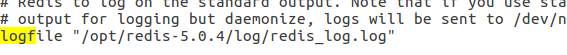
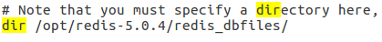

# Redis安装过程中的问题

## 问题

运行

```shell
redis-server /opt/redis-5.0.4
redis-cli -p 6379
```

正常进入连接，但是在SHUTDOWN的时候报错：

```shell
Errors trying to SHUTDOWN. Check logs.
```

## 解决

1.修改/opt/redis-5.0.4/redis.conf文件，将其中的





logfile ""改为如图，dir 改为如图

并且修改其权限

```shell
sudo chmod 777 log
sudo chmod 777 redis_log.log
sudo chmod 777 redis_dbfiles
```

2.重新启动

```shell
redis-server /opt/redis-5.0.4/redis.conf
redis-cli
```

若服务正在启动，可以通过命令

```shell
ps -ef|grep redis
```

查看