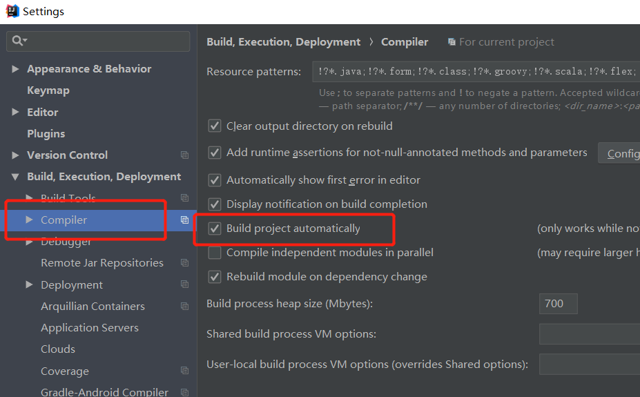

## 热部署

```java
   <!--热部署开发工具-->
        <dependency>
            <groupId>org.springframework.boot</groupId>
            <artifactId>spring-boot-devtools</artifactId>
            <optional>true</optional>
        </dependency>
        <dependency>
            <groupId>redis.clients</groupId>
            <artifactId>jedis</artifactId>
            <version>2.9.0</version>
        </dependency>
```



```yml
#热部署
  debug: true
  spring:
    devtools:
      restart:
        enabled: true  #设置开启热部署
        exclude: classpath:/templates/
    freemarker:
      cache: false    #页面不加载缓存，修改即时生效
```

## 把项目打成war包

1.在pom中添加插件

```xml
 <build>
        <finalName>${project.artifactId}</finalName>
        <plugins>
            <plugin>
                <groupId>org.springframework.boot</groupId>
                <artifactId>spring-boot-maven-plugin</artifactId>
            </plugin>
            <!-- https://mvnrepository.com/artifact/org.apache.maven.plugins/maven-war-plugin -->
            <plugin>
                <groupId>org.apache.maven.plugins</groupId>
                <artifactId>maven-war-plugin</artifactId>
                <configuration>
                    <failOnMissingWebXml>false</failOnMissingWebXml>
                </configuration>
            </plugin>

            <plugin>
                <artifactId>maven-compiler-plugin</artifactId>
                <configuration>
                    <source>1.8</source>
                    <target>1.8</target>
                    <fork>true</fork>
                </configuration>
            </plugin>


        </plugins>
    </build>
```

修改pom.xml中的

```xml
<packaging>war</packaging>

```

```java
//继承SpringBootServletInitializer
public class SpringBootJdbcApplication extends SpringBootServletInitializer {

    public static void main(String[] args) {
        SpringApplication.run(SpringBootJdbcApplication.class, args);
    }
//重写方法
    @Override
    protected SpringApplicationBuilder configure(SpringApplicationBuilder builder) {
        return builder.sources(SpringBootJdbcApplication.class);
    }
}
```

用mvn工具打包

```shell
mvn clean package
```

## 三、使用redis 缓存

#### 1. jedis

直接注入使用

```java
 @Autowired
 RedisTemplate redisTemplate;
```

使用这个template，保存的数据必需要可序列化的，保存入redis的时候是保存序列化的数据，默认的序列化规则是jdk的，看不懂，所以要自定义序列化规则。

#### 2.自定义序列化规则

```java
@Configuration
public class MyRedisConfig {
    @Bean
    public RedisTemplate<Object, User> userRedisTemplate(RedisConnectionFactory redisConnectionFactory) throws UnknownHostException {
        RedisTemplate<Object, User> template = new RedisTemplate();
        template.setConnectionFactory(redisConnectionFactory);
//        设置序列化规则,json形式
        template.setDefaultSerializer(new Jackson2JsonRedisSerializer<User>(User.class));
        return template;
    }
}
```

#### 3.注入自定义的template

```java
  @Autowired
  RedisTemplate<Object,User> userRedisTemplate;
```


#### 4.导包

```xml
  <dependency>
            <groupId>org.springframework.boot</groupId>
            <artifactId>spring-boot-starter-cache</artifactId>
        </dependency>
```

#### 5.开启缓存

```java
@SpringBootApplication
@EnableCaching  //开启缓存
public class DemoApplication {

    public static void main(String[] args) {
        SpringApplication.run(DemoApplication.class, args);
    }

}
```

#### 6.使用缓存

```java
 @Cacheable(cacheNames = {"user"})
    public User getUser(String s) {
        System.out.println("查询了:"+s);
        return userMapper.getUserById(s);
    }
```

## 四、spring security

#### 1.引入依赖

```xml
 <dependency>
            <groupId>org.springframework.boot</groupId>
            <artifactId>spring-boot-starter-security</artifactId>
        </dependency>
```

#### 2.配置


