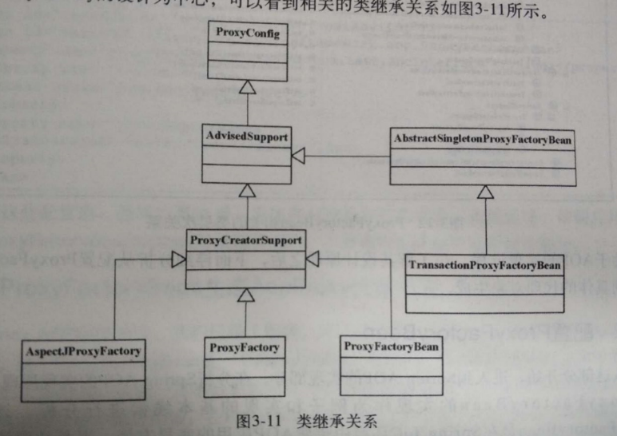
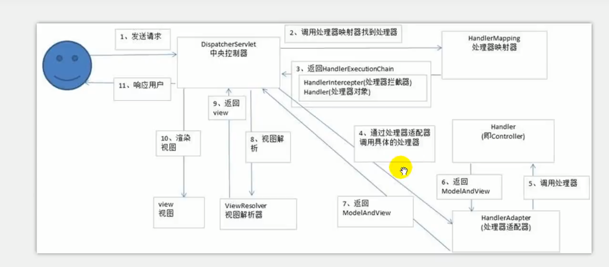

# Spring 技术内幕

## 1.1 IOC容器的设计与实现：BeanFactory和Applicationcontext

BeanFactory:简单容器系列

例：XmlBeanFactory，这个XmlBeanFactory的功能是建立在DefaultListableBeanFactory这个基本容器之上的。

Applicationcontext：容器的高级形态

## 1.2 IoC容器的初始化过程

IoC容器的初始化是由refresh()方法来启动的。这个启动包括**BeanDefinition的Resource定位**、**载入**和**注册**三个基本过程

### 1.2.1 Resource定位

这个Resource定位是指BeanDefinition的资源定位（找水的过程）

### 1.2.2 BeanDefinition的载入

这个载入过程是把用户定义好的Bean表示成IoC容器内部的数据结构。其中包括解析过程。

### 1.2.3 向IOC容器注册BeanDefinition

在IoC容器内部将BeanDefinition注入到一个HashMap中。

> HashMap是IoC容器的最基本的数据结构。

## 1.3 IoC容器的依赖注入

依赖注入的过程是用户第一次向IoC容器索要Bean时触发的（getBean方法），或者通过控制lazy-init属性来让容器完成对Bean的预实例化。

getBean是依赖注入的起点，之后调用createBean，Bean对象会依据BeanDefinition定义的要求生成。

## 1.4 ApplicationContext 和 Bean的初始化和销毁

**启动容器：**ApplicationContextqidong启动是在AbstractApplicationContext中完成的，容器初始化的时候，调用prepareBeanFactory()，在容器中配置ClassLoader、PropertyEditor等。

**关闭容器：**在容器关闭的时候使用doClose()关闭，在这个方法中，先发出容器关闭的信号，然后将Bean逐个关闭，最后关闭容器自身。

------


## 第二部分 AOP

### Advice 通知

Advice 定义在**连接点**做什么，为切面增强提供织入借口。

###  Pointcut 切点

Pointcut 决定Advice通知应该作用于哪个**连接点**，也就是说通过Pointcut来定义需要增强的方法的**集合**。

在Pointcut 的基本接口中定义，需要返回一个MethodMatcher，对于MethodMatcher来判断是否需要对当前方法调用进行增强。

###  Advisor通知器

把Advice 和Pointcut 结合起来。

在DefaultPointcutAdvisor中，pointcut默认被设置成Pointcut.True

```java
Pointcut pointcut = Pointcut.TRUE
```

Pointcut.TRUE定义为：Pointcut TRUE = TruePointcut.INSTANCE，是一个单件。

TruePointcut的methodMatcher实现中，使用TrueMethodMatcher作为方法匹配器，这个匹配器对任何的方法匹配都返回true。

### 2.2 Spring AOP 的设计与实现

### 2.3 建立AopProxy代理对象

#### 2.3.1 设计原理



在ProxyFactoryBean中封装了主要代理对象的生成过程，在这个过程中，可以使用JDK的Proxy和CGLIB两种生成方式。

- ProxyConfig 可以看成是一个数据基类
- AdvisedSuppot 封装了AOP对通知和通知器的相关操作，对于具体的AOP代理对象的创建，交给子类完成。
- ProxyCreatorSupport 可以将它看成是其子类创建AOP创建代理对象的辅助类。
- ProxyFactoryBean和ProxyFactory都提供了AOP功能的封装，使用ProxyFactoryBean，可以在IoC容器中完成**声明式**配置（xml），而使用ProxyFactory，则需要**编程式**地使用Spring AOP功能。


#### 2.3.2 配置ProxyFactoryBean

1. 定义使用的通知器Advisor，这个通知器作为一个Bean来定义，通知器中包含了通知。
2. 定义ProxyFactoryBean，作为一个Bean来定义，它是封装AOP功能的主要类。
3. 定义target属性，作为target注入的Bean，是目标对象。
4. 

#### 2.3.3 ProxyFactoryBean生成AopProxy代理对象

ProxyFactoryBean的AOP实现需要依赖JDK或者CGLIB提供的Proxy特性，从FactoryBean中获取对象，是以getObject()方法作为入口完成的，<u>增强处理都通过getObject()进行了封装</u>。

getObject()首先对通知器链进行初始化(<u>initializeAdvisorChain方法</u>)，通知器链封装了一系列的**拦截器**。

在生成代理对象的时候，根据singleton类型和prototype类型生成不同的Bean

如果是singleton则调用<u>getSingletonInstance()方法</u>。

getSingletonInstance()方法使用AopProxyFactory来创建AopProxy，AopProxyFactory使用的是<u>DefaultAopProxyFactory</u>.

在DefaultAopProxyFactory的<u>createAopProxy()</u>方法中通过判断targetClass是不是**接口类**来选择具体对JDK和CGLIB的使用。JDK(接口类使用)。

```java
new JdkDynamicAopProxy()
CglibProxyFactory.createCglibProxy()
```

#### 2.3.4 JDK生成AopProxy代理对象

JdkDynamicAopProxy自己实现了InvocationHandler接口，实现了<u>invoke</u>方法，所以可以把自己当成回调函数。

所以JdkDynamicAopProxy有一个这样的方法getProxy()

```java
return Proxy.newProxyInstance(classLoader,proxiedInterfaces,this);
```

### 2.4 Spring AOP 拦截器调用的实现

#### 2.4.1 JdkDynamicAopProxy的invoke拦截

在invoke方法中做以下步骤

1. 得到目标对象
2. <u>获得拦截器链</u> (List<Object> chain)
3. 沿着拦截器挨个实现
4. 如果没有拦截器的话直接调用target的对应方法。

#### 2.4.2 Cglib2AopProxy的intercept拦截

1. 得到目标对象
2. 从advised中取得配置好的AOP通知 (List<Object> chain)
3. 如果没有通知，就直接调用目标对象的方法

#### 2.4.3 目标方法的调用

通过反射

#### 2.4.4 AOP拦截器链的调用

在这里使用matches匹配pointcut切点是否需要实行通知增强。

#### 2.4.5 配置通知器

获取interceptors的操作是由<u>advised</u>对象完成的。

取得拦截器链的工作是由配置好的advisorChainFactory来完成的，<u>DefaultadvisorChainFactory</u>实现了链的获取过程。

DefaultadvisorChainFactory会调用<u>AdvisorAdapterRegistry的实现DefaultAdvisorAdapterRegistry的方法getInterceptors()</u>，并把<u>advisor</u>作为参数来得到拦截器，来实现拦截器的注册。

<u>advisor</u>是在ProxyFactoryBean的getObject()方法中对advisor进行初始化，从XML配置中获取advisor通知器，调用getBean()来的到通知器。

#### 2.4.6 Advice通知的实现

在DefaultadvisorChainFactory中设置了一些列的适配器(MethodBeforeAdvice,AfterReturningAdvice,ThrowsAdvice)。

getInterceptors()方法里遍历合适的适配器适配advisor，生成一个拦截器，例：MethodBeforeAdviceInterceptor(advice)。

在适配过程中，根据不同的适配器实现不一样，比如先执行before方法之后再执行proceed方法。

直接用这个拦截器的对象调用invoke()方法调用最终结果。

